# Dify 互動式教學網站 - 規格文件

## 1. 架構與選型

### 1.1 專案概述
建立一個精美的互動式教學網站，用於教授 Dify 平台的使用方法。網站設計參考 [gemini-cli-tutorial](https://github.com/kevintsai1202/gemini-cli-tutorial) 的架構，提供深色主題、側邊欄導航、學習計時器、進度追蹤等功能。

### 1.2 技術選型
| 技術 | 說明 |
|------|------|
| HTML5 | 網頁結構，語義化標籤 |
| CSS3 | 樣式設計，使用 Grid、Flexbox、動畫 |
| Vanilla JavaScript (ES6+) | 互動邏輯，無需框架 |
| Prism.js | 程式碼語法高亮 |
| Font Awesome 6 | 圖標系統 |
| marked.js | Markdown 渲染（用於載入課程內容） |

### 1.3 設計理念
- **深色主題**：專業護眼，適合長時間學習
- **漸層背景**：現代視覺效果
- **卡片式設計**：內容區塊清晰分明
- **響應式佈局**：支援桌面與行動裝置

---

## 2. 資料模型

### 2.1 課程結構資料模型
```javascript
/**
 * 課程章節資料結構
 */
const CourseChapter = {
  id: String,           // 章節唯一識別碼，例如 "chapter-1"
  title: String,        // 章節標題
  duration: Number,     // 預估學習時間（分鐘）
  units: Array<Unit>,   // 單元列表
  isCompleted: Boolean  // 章節完成狀態
};

/**
 * 單元資料結構
 */
const Unit = {
  id: String,           // 單元唯一識別碼，例如 "unit-1-1"
  title: String,        // 單元標題
  duration: Number,     // 預估學習時間（分鐘）
  contentPath: String,  // Markdown 內容路徑
  isCompleted: Boolean  // 單元完成狀態
};

/**
 * 學習進度資料結構（存於 localStorage）
 */
const LearningProgress = {
  completedUnits: Array<String>,  // 已完成的單元 ID 列表
  totalStudyTime: Number,         // 總學習時間（秒）
  todayStudyTime: Number,         // 今日學習時間（秒）
  lastStudyDate: String,          // 最後學習日期 (YYYY-MM-DD)
  currentUnit: String             // 目前閱讀的單元 ID
};
```

### 2.2 課程內容對應
根據 `課綱` 目錄結構，課程分為 6 大章節：

| 章節 | 標題 | 單元數 |
|------|------|--------|
| 1 | 環境準備篇（增加社群版安裝方式） | 3 |
| 2 | 入門篇 - Dify 基礎入門 | 6 |
| 3 | 基本操作篇 - 打造第一個 AI 對話助手 | 10 |
| 4 | 應用篇 - 實戰應用開發 | 8 |
| 5 | 進階應用篇 - 進階技巧與深度應用 | 11 |
| 6 | 進階開發篇 - 插件與 MCP 應用（進階選修） | 9 |

---

## 3. 關鍵流程

### 3.1 頁面載入流程
1. 載入 HTML 基礎結構
2. 初始化 CSS 樣式與動畫
3. 載入課程章節資料 (`courses.json`)
4. 從 localStorage 讀取學習進度
5. 渲染側邊欄導航選單
6. 載入預設/上次閱讀的單元內容
7. 啟動學習計時器

### 3.2 單元切換流程
1. 使用者點擊側邊欄單元項目
2. 更新 URL hash（支援書籤）
3. 載入對應的 Markdown 內容
4. 使用 marked.js 渲染 HTML
5. 使用 Prism.js 高亮程式碼
6. 捲動至頁面頂部
7. 更新目前單元狀態

### 3.3 進度追蹤流程
1. 使用者點擊「標記為已完成」按鈕
2. 更新 localStorage 中的 completedUnits
3. 更新側邊欄對應項目的完成狀態圖示
4. 計算並更新整體進度百分比
5. 更新進度條顯示

---

## 4. 虛擬碼

### 4.1 課程載入
```
FUNCTION loadCourseData():
    data = FETCH("courses.json")
    FOR EACH chapter IN data.chapters:
        createChapterElement(chapter)
        FOR EACH unit IN chapter.units:
            createUnitElement(unit)
    END FOR
    loadProgress()
    navigateToLastUnit()
END FUNCTION
```

### 4.2 Markdown 內容載入
```
FUNCTION loadUnitContent(unitId):
    unit = findUnitById(unitId)
    IF unit IS NULL:
        showError("單元不存在")
        RETURN
    END IF
    
    markdown = FETCH(unit.contentPath)
    html = marked.parse(markdown)
    contentElement.innerHTML = html
    
    Prism.highlightAll()
    updateCurrentUnit(unitId)
    scrollToTop()
END FUNCTION
```

### 4.3 學習計時器
```
CLASS StudyTimer:
    PROPERTY totalSeconds = 0
    PROPERTY todaySeconds = 0
    PROPERTY intervalId = null
    
    METHOD start():
        intervalId = setInterval(() => {
            totalSeconds++
            todaySeconds++
            updateTimerDisplay()
            saveProgress()
        }, 1000)
    END METHOD
    
    METHOD stop():
        clearInterval(intervalId)
    END METHOD
    
    METHOD formatTime(seconds):
        hours = floor(seconds / 3600)
        minutes = floor((seconds % 3600) / 60)
        secs = seconds % 60
        RETURN format("{hours}:{minutes}:{secs}")
    END METHOD
END CLASS
```

---

## 5. 系統脈絡圖 (System Context Diagram)

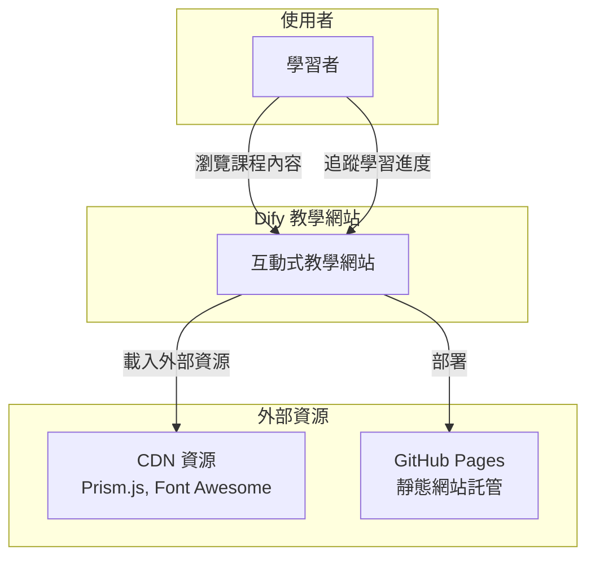

---

## 6. 容器/部署概觀

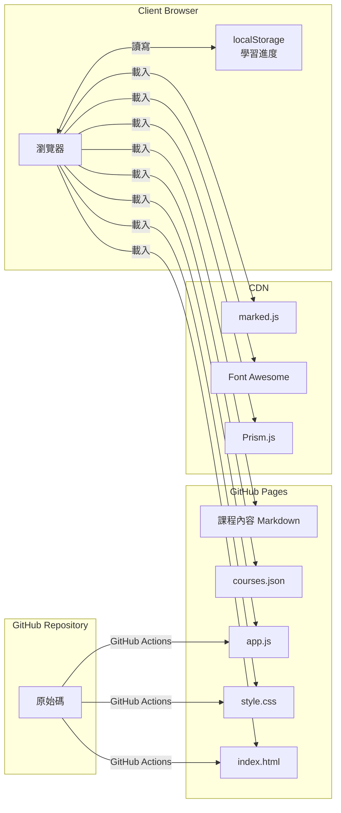

---

## 7. 模組關係圖 (Frontend Module Architecture)

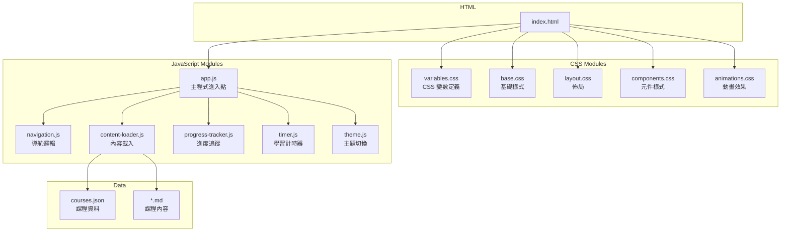

---

## 8. 序列圖

### 8.1 頁面載入序列圖

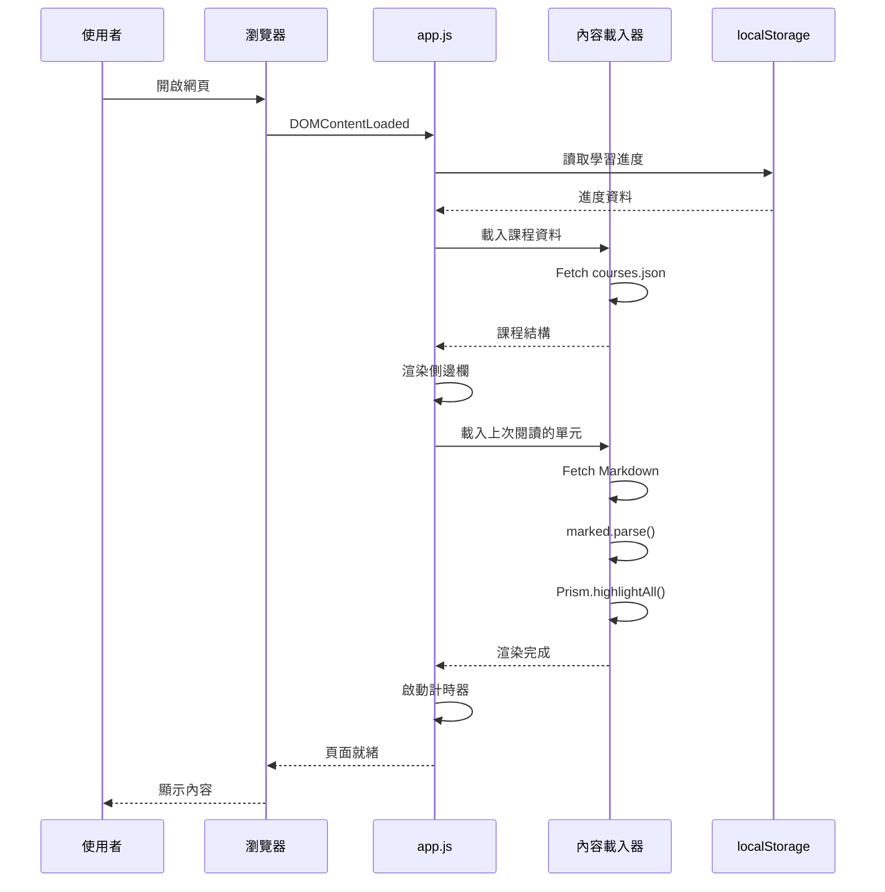

### 8.2 標記完成序列圖

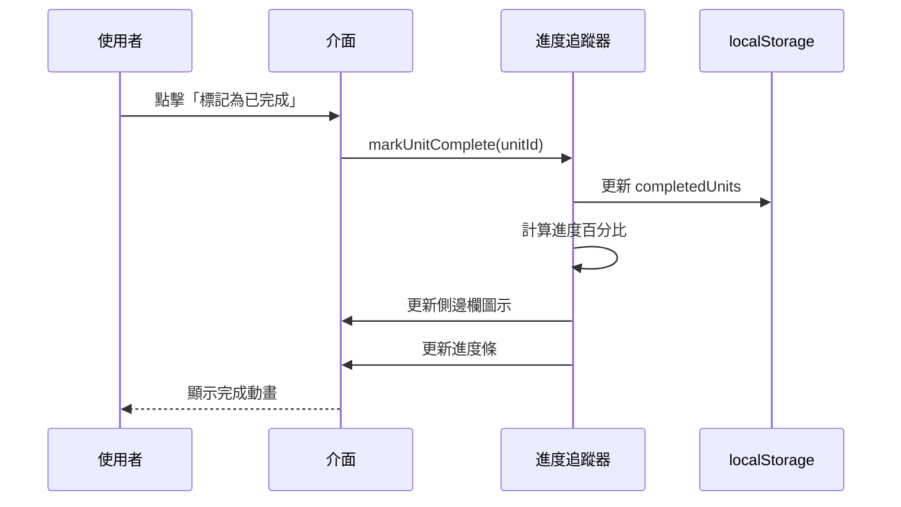

---

## 9. ER 圖

本專案為純前端靜態網站，無後端資料庫。資料儲存於：
1. **courses.json** - 課程結構資料
2. **localStorage** - 使用者學習進度

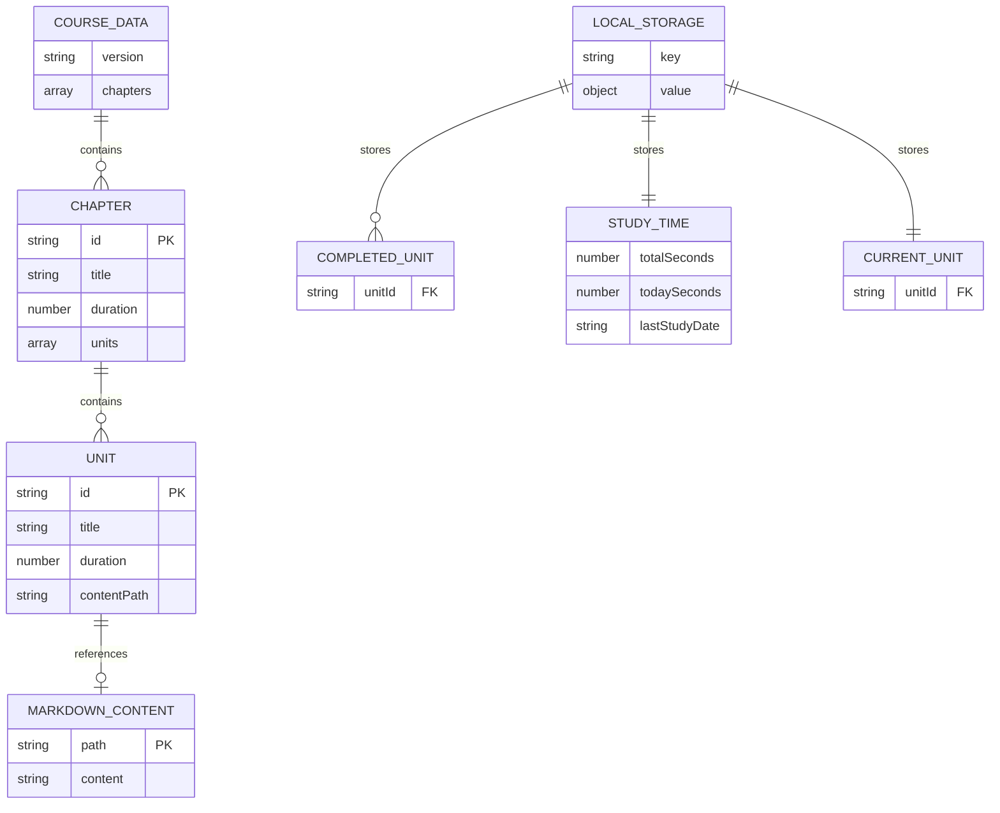

---

## 10. 類別圖（前端關鍵類別）

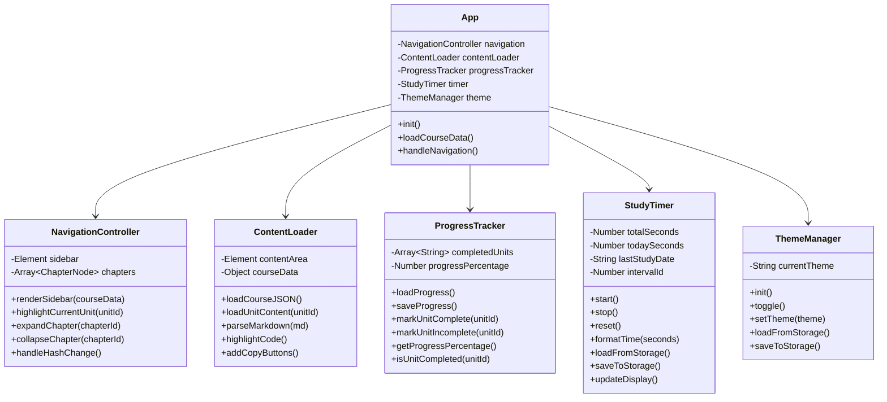

---

## 11. 流程圖

### 11.1 內容載入流程圖

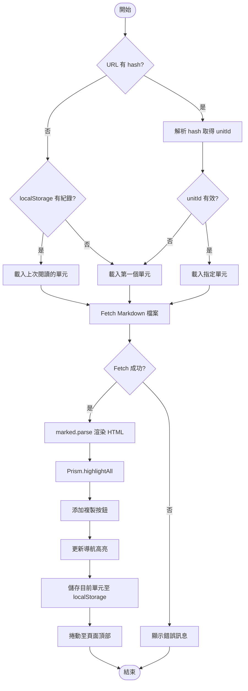

### 11.2 進度追蹤流程圖

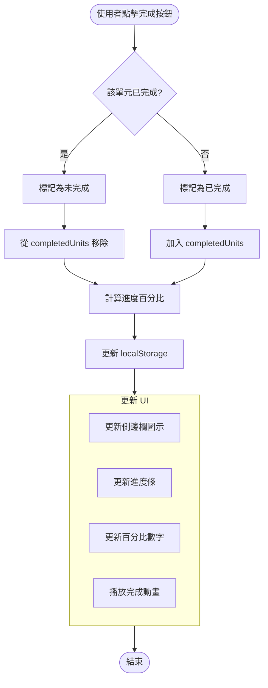

---

## 12. 狀態圖

### 12.1 單元狀態圖

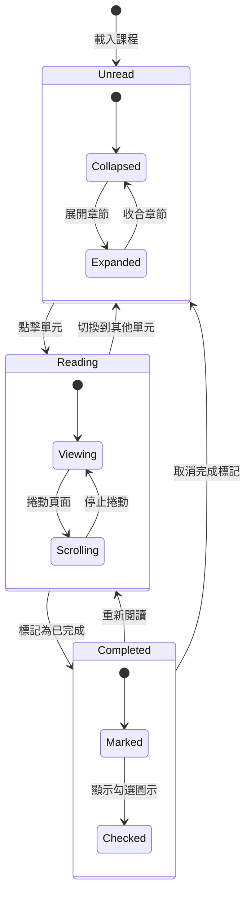

### 12.2 計時器狀態圖

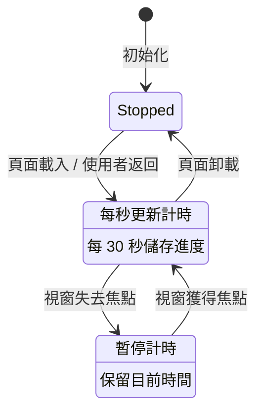

---

## 13. 檔案結構

```
dify-tutorial/
├── index.html              # 主頁面
├── style.css               # 主樣式檔（或拆分為多個 CSS）
├── app.js                  # 主程式
├── courses.json            # 課程結構資料
├── README.md               # 專案說明
├── spec.md                 # 規格文件（本文件）
├── api.md                  # API 文件（本專案為靜態網站，無需）
├── 課綱/                   # 課程內容 Markdown 檔案
│   ├── 1.環境準備篇/
│   │   ├── 單元 1 - 本地安裝 Docker/
│   │   │   └── readme.md
│   │   ├── 單元 2 - 安裝社群版 Dify/
│   │   │   └── readme.md
│   │   └── 單元 3 - 透過 Zeabur 安裝社群版 Dify/
│   │       └── readme.md
│   ├── 2.入門篇 - Dify 基礎入門/
│   │   └── ... (6 單元)
│   ├── 3.基本操作篇/
│   │   └── ... (10 單元)
│   ├── 4.應用篇/
│   │   └── ... (8 單元)
│   ├── 5.進階應用篇/
│   │   └── ... (11 單元)
│   └── 6.進階開發篇/
│       └── ... (9 單元)
└── assets/                 # 靜態資源
    ├── images/             # 圖片
    └── icons/              # 自訂圖標
```

---

## 14. 功能清單

### 核心功能
- [x] 深色主題介面設計
- [x] 響應式側邊欄導航
- [x] Markdown 內容渲染
- [x] 程式碼語法高亮
- [x] 一鍵複製程式碼
- [x] 學習進度追蹤
- [x] 學習計時器
- [x] 章節展開/收合
- [x] URL hash 導航支援
- [x] localStorage 持久化

### 進階功能（可選）
- [ ] 淺色/深色主題切換
- [ ] 搜尋功能
- [ ] 目錄自動生成
- [ ] 圖片燈箱效果
- [ ] 互動式小測驗
- [ ] 學習筆記功能

---

## 15. 效能考量

1. **延遲載入**：僅在需要時載入 Markdown 內容
2. **快取策略**：已載入的內容可暫存避免重複請求
3. **最小化依賴**：僅使用必要的外部函式庫
4. **CSS 動畫**：使用 GPU 加速的 transform/opacity 屬性
5. **節流/防抖**：對捲動和視窗調整事件進行最佳化
