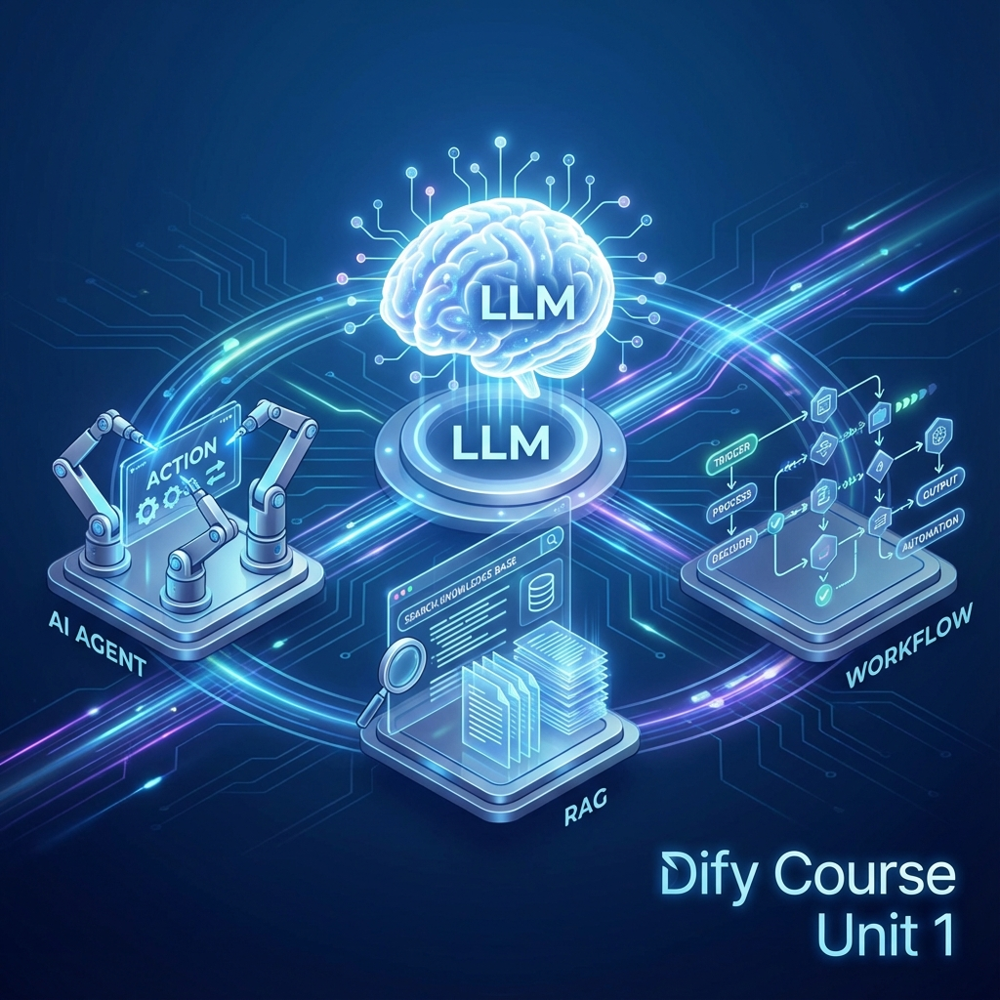
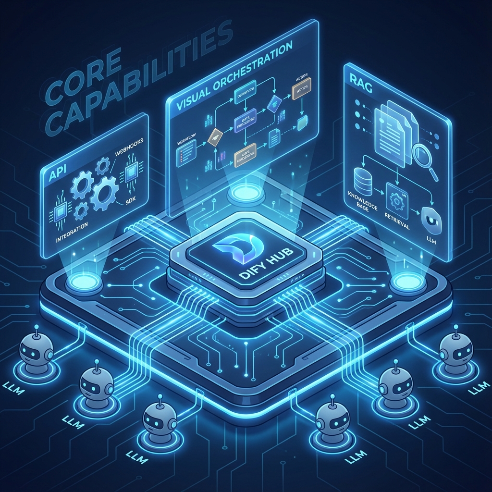
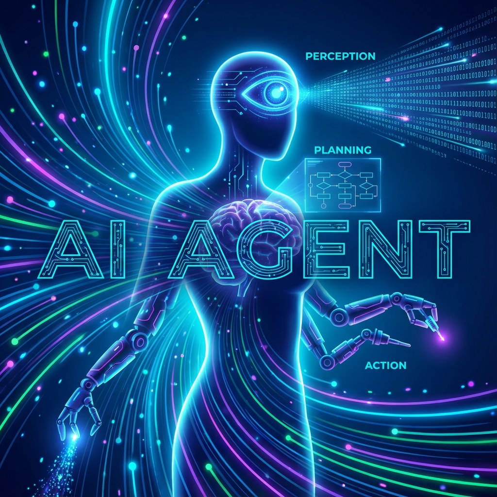
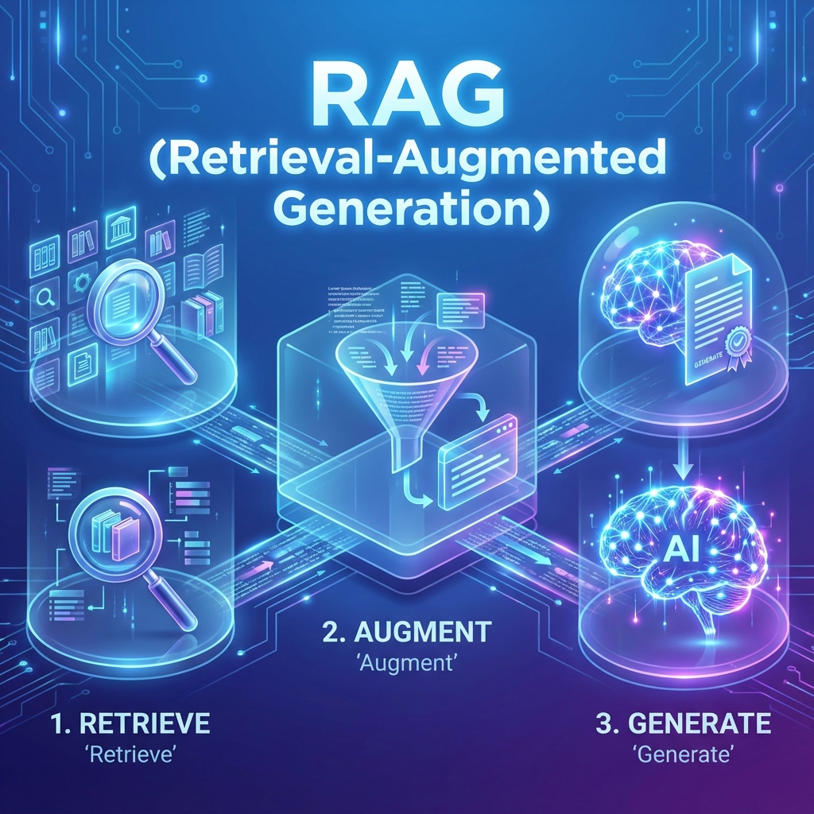
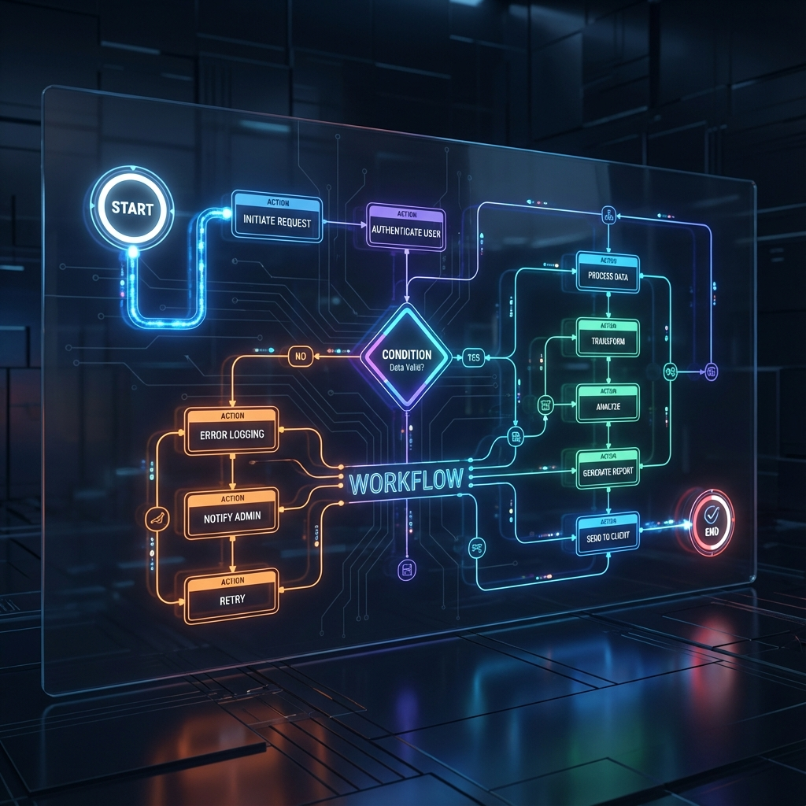

# 單元 1 - 課程介紹

歡迎來到 Dify 入門課程的第一單元。本單元將帶領您快速認識 Dify 這個強大的 LLM 應用開發平台，並建立對 AI Agent、RAG 以及 Workflow 等核心概念的基礎認知。

## 1. 課程介紹：Dify 的核心能力

Dify 是一個開源的 LLM 應用開發平台，旨在讓開發者（甚至是非技術人員）能夠輕鬆地構建、部署和管理基於大型語言模型的應用程式。

**Dify 的主要能力包含：**

*   **模型中立 (Model Agnostic)**：支援市面上主流的 LLM (如 GPT-4, Claude, Gemini, Llama 等)，讓您可以自由切換並選擇最適合的模型。
*   **可視化編排 (Visual Orchestration)**：透過直觀的介面設計 Prompt 和 Workflow，降低開發門檻。
*   **RAG 引擎 (RAG Engine)**：內建強大的知識庫檢索功能，支援多種文件格式與切片策略，讓 AI 能夠根據您的私有數據回答問題。
*   **AI Agent 框架**：提供建構自主 Agent 的工具，支援工具調用 (Function Calling)，讓 AI 能夠執行實際任務。
*   **後端即服務 (Backend-as-a-Service)**：自動生成 API，讓您可以將 Dify 構建的應用輕鬆整合到您的前端或現有系統中。
*   **運維監控 (LLMOps)**：提供日誌分析、標註改進等功能，協助您持續優化應用效果。

---

## 2. AI Agent 是什麼？

AI Agent (人工智能代理) 不僅僅是一個會聊天的機器人。它是一個被賦予了 **「感知」、「規劃」、「行動」** 能力的智能體。

*   **傳統 Chatbot**：只能根據訓練數據進行被動問答。
*   **AI Agent**：
    *   **感知 (Perception)**：理解用戶意圖與環境上下文。
    *   **規劃 (Planning)**：能夠拆解複雜任務，思考解決步驟 (如 ReAct 模式)。
    *   **行動 (Action)**：能夠使用 **工具 (Tools)**（例如：搜尋聯網、查詢資料庫、發送郵件、執行 Python 代碼）來達成目標。

**簡單來說：AI Agent = LLM (大腦) + Memory (記憶) + Planning (規劃) + Tools (手腳)。**

---

## 3. RAG (Retrieval-Augmented Generation) 用途

大型語言模型雖然博學，但有兩個主要缺陷：
1.  **知識幻覺 (Hallucination)**：一本正經地胡說八道。
2.  **知識截止 (Knowledge Cutoff)**：無法回答最新的時事，也無法知道您公司的內部機密。

**RAG (檢索增強生成)** 就是為了解決這些問題而生的技術。

**RAG 的運作流程：**
1.  **檢索 (Retrieve)**：當用戶提問時，系統先去您的 **知識庫 (Knowledge Base)** 中搜尋相關的片段。
2.  **增強 (Augment)**：將搜尋到的片段作為「參考資料 (Context)」補充到 Prompt 中。
3.  **生成 (Generate)**：LLM 根據參考資料，生成準確且基於事實的回答。

**用途：** 企業知識問答、客戶服務、法規查詢、個人筆記助理等。

---

## 4. 為什麼需要 Workflow (工作流)？

在簡單的問答場景中，單一的 Prompt 可能就足夠了。但在複雜的業務場景中，我們往往需要更嚴謹的控制和邏輯處理。

**為什麼需要 Workflow？**

*   **處理複雜邏輯**：例如「如果使用者問 A，則執行步驟 X；如果問 B，則執行步驟 Y」。Workflow 允許您使用條件分支 (If/Else) 來控制流程。
*   **確定性與穩定性**：LLM 本質上是機率性的 (生成的文字可能每次不同)。Workflow 可以透過固定的邏輯節點 (如資料處理、格式轉換) 來增加系統的穩定性和可預測性。
*   **模組化與串聯**：您可以將不同的任務模組串聯起來。例如：先用 LLM 摘要文章 -> 再用搜尋工具找相關圖片 -> 最後整合成一篇包含圖文的報告。
*   **錯誤處理**：在流程中加入錯誤重試或降級處理機制，提高系統的魯棒性。

Dify 的 Workflow 畫布讓您能像堆積木一樣，將 LLM、工具、邏輯判斷等節點組合成強大的應用程式。

---

## 📝 課後小測驗

> [!QUIZ]
> **Q: AI Agent 的三大核心能力是什麼？**
> - [ ] 搜尋、翻譯、繪圖
> - [x] 感知、規劃、行動
> - [ ] 閱讀、寫作、編程

> [!QUIZ]
> **Q: RAG 技術主要解決 LLM 的哪個問題？**
> - [ ] 運算速度太慢
> - [ ] 模型太大無法部署
> - [x] 知識幻覺與知識截止
