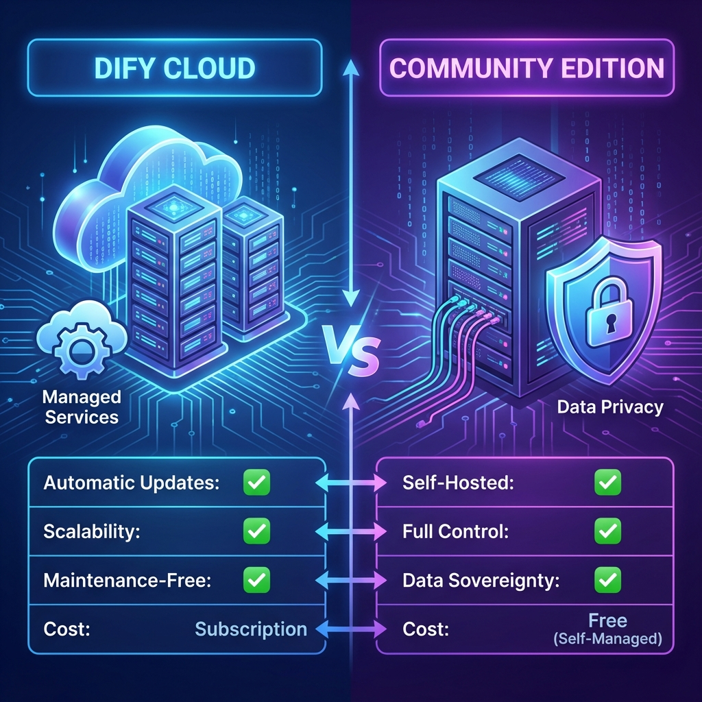

# 單元 2 - Dify 雲端版本與社群版本差異

> 🕐 預估時長：10 分鐘

## 學習目標

完成本單元後，您將能夠：
- 了解 Dify 雲端版與社群版的功能差異
- 根據需求選擇適合的版本
- 理解各版本的使用場景

## 內容大綱

### 1. 版本比較

| 特性 | 雲端版 (Cloud) | 社群版 (Community) |
|------|----------------|---------------------|
| 部署方式 | 託管服務 | 自行部署 |
| 維護成本 | 零維護 | 需要維護伺服器 |
| 數據隱私 | 存於雲端 | 完全自控 |
| 費用 | 訂閱制/免費額度 | 僅伺服器成本 |
| 功能更新 | 自動更新 | 需手動更新 |

### 2. 雲端版優勢
- **快速上手**：註冊即可使用
- **免維護**：官方負責維護與升級
- **穩定性高**：專業團隊保障服務可用性

### 3. 社群版優勢
- **數據自主**：敏感數據不離開您的伺服器
- **無限制使用**：不受 API 呼叫次數限制
- **深度客製**：可修改原始碼滿足特殊需求

### 4. 如何選擇？
- **個人學習/小型專案** → 雲端版
- **企業內部應用/隱私敏感** → 社群版
- **需要客製化功能** → 社群版

---

## 📝 課後小測驗

> [!QUIZ]
> **Q: 如果您的公司有嚴格的數據隱私政策，不允許數據離開內部伺服器，應該選擇哪個版本？**
> - [ ] 雲端版，因為更穩定
> - [x] 社群版，因為數據完全自控
> - [ ] 兩者皆可
