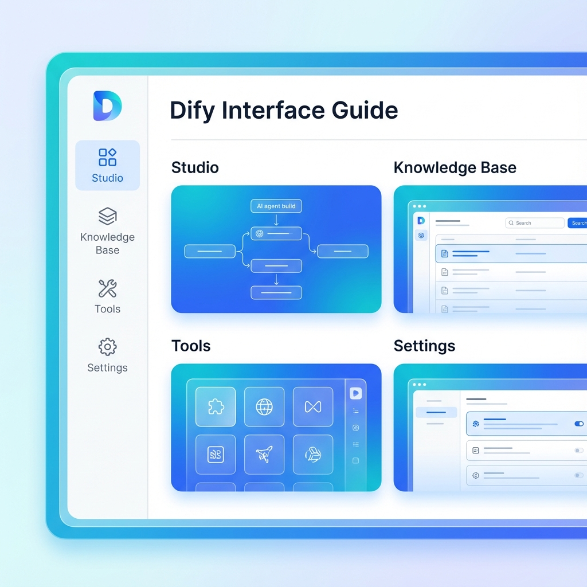

# 單元 3 - 介面說明

> 🕐 預估時長：15 分鐘

## 學習目標

完成本單元後，您將能夠：
- 熟悉 Dify 管理介面的主要區塊
- 了解各功能模組的用途
- 快速找到所需的設定項目

## 內容大綱

### 1. 主導航區域

Dify 的左側導航列包含以下主要區塊：

- **工作室 (Studio)**：建立與管理應用程式
- **知識庫 (Knowledge)**：管理 RAG 文件資料
- **工具 (Tools)**：管理 API 工具與插件
- **資源監控**：查看使用量與日誌

### 2. 工作室介面

工作室是您建立 AI 應用的主要場所：
- **應用列表**：顯示所有已建立的應用
- **建立應用**：選擇應用類型並開始建構
- **應用設定**：調整 Prompt、模型參數等

### 3. 知識庫介面

知識庫讓您的 AI 能夠存取私有數據：
- **文件上傳**：支援 PDF、Word、Markdown 等格式
- **分塊設定**：調整文件分割策略
- **檢索測試**：測試搜尋效果

### 4. 系統設定

右上角的設定齒輪可進入：
- **模型供應商**：設定 API Key
- **成員管理**：團隊協作設定
- **帳戶設定**：個人資訊

---

## 📝 課後小測驗

> [!QUIZ]
> **Q: 要上傳公司內部文件讓 AI 能夠回答相關問題，應該使用哪個功能？**
> - [ ] 工作室
> - [x] 知識庫
> - [ ] 工具
