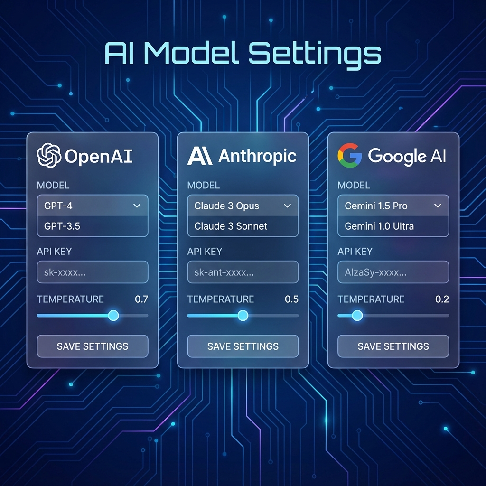

# 單元 4 - AI 模型設定說明

> 🕐 預估時長：15 分鐘

## 學習目標

完成本單元後，您將能夠：
- 設定各家 LLM 供應商的 API Key
- 了解不同模型的特性與適用場景
- 設定 Embedding 模型供知識庫使用

## 內容大綱

### 1. 模型供應商概覽

Dify 支援多家模型供應商：

| 供應商 | 代表模型 | 特色 |
|--------|----------|------|
| OpenAI | GPT-4, GPT-3.5 | 泛用性最佳 |
| Anthropic | Claude 3 | 長文處理優異 |
| Google | Gemini | 多模態能力 |
| 阿里雲 | 通義千問 | 中文表現佳 |
| 本地模型 | Llama, Qwen | 數據不離開本地 |

### 2. 設定 API Key

1. 進入「設定」→「模型供應商」
2. 選擇欲使用的供應商
3. 輸入對應的 API Key
4. 點擊「儲存」

### 3. 模型參數說明

- **Temperature**：控制回答的隨機性（0~1）
  - 0 = 確定性高，適合程式碼生成
  - 1 = 創意性高，適合創意寫作
- **Max Tokens**：回答的最大長度限制
- **Top P**：另一種控制隨機性的方式

### 4. Embedding 模型

Embedding 模型用於知識庫的向量檢索：
- **text-embedding-ada-002** (OpenAI)
- **text-embedding-3-small** (OpenAI)
- **bge-large-zh** (適合中文)

---

## 📝 課後小測驗

> [!QUIZ]
> **Q: 如果要讓 AI 產生更穩定、可預測的回答，應該將 Temperature 設定為？**
> - [x] 接近 0
> - [ ] 接近 1
> - [ ] 0.5 最佳
