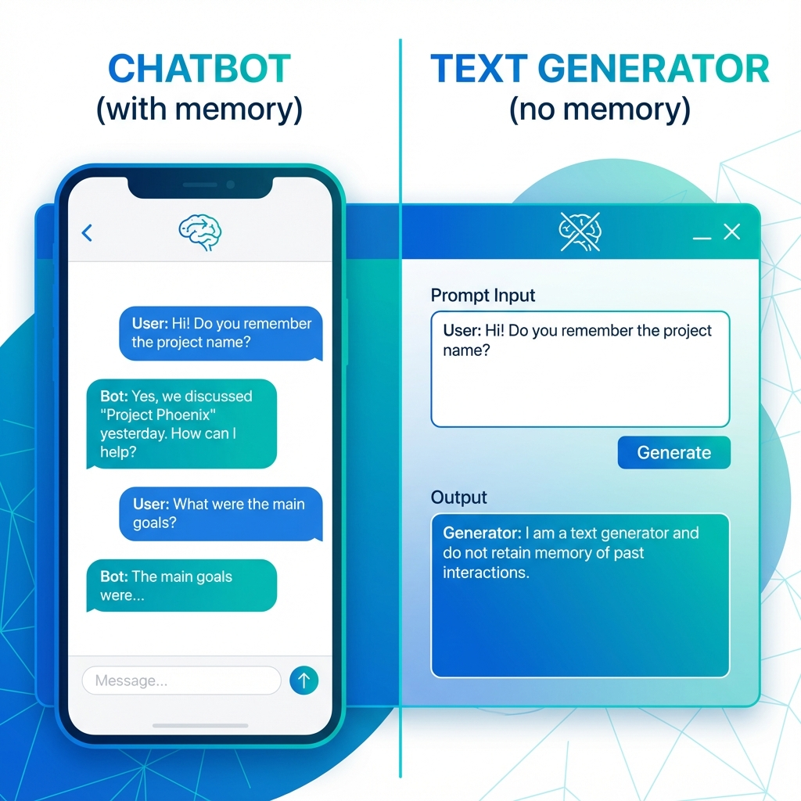

# 單元 6 - 聊天助手與文字生成應用說明



> 🕐 預估時長：20 分鐘

## 學習目標

完成本單元後，您將能夠：
- 建立基礎的聊天助手應用
- 建立文字生成應用
- 了解兩者的設定差異

## 內容大綱

### 1. 建立聊天助手

#### Step 1: 新建應用
1. 進入「工作室」
2. 點擊「建立新應用」
3. 選擇「聊天助手」

#### Step 2: 設定 Prompt
在「提示詞」區域設定 AI 的角色與行為：
```
你是一個友善的客服助理，專門回答產品相關問題。
請用簡潔、專業的語氣回答用戶的問題。
```

#### Step 3: 設定對話開場白
設定 AI 主動打招呼的內容：
```
您好！我是客服小助理，有什麼可以幫助您的嗎？
```

### 2. 建立文字生成應用

#### 輸入變數
可定義使用者需要填寫的欄位：
- `{{article}}`：待摘要的文章
- `{{language}}`：目標語言

#### Prompt 範例
```
請將以下文章摘要成 3 個要點，使用 {{language}} 輸出：

{{article}}
```

### 3. 兩者差異比較

| 特性 | 聊天助手 | 文字生成 |
|------|----------|----------|
| 對話記憶 | ✅ 有 | ❌ 無 |
| 輸入方式 | 對話框 | 表單欄位 |
| 適用場景 | 多輪問答 | 單次處理 |

---

## 📝 課後小測驗

> [!QUIZ]
> **Q: 「聊天助手」與「文字生成」的主要差異是什麼？**
> - [ ] 使用的模型不同
> - [x] 聊天助手有對話記憶，文字生成沒有
> - [ ] 文字生成比較快
