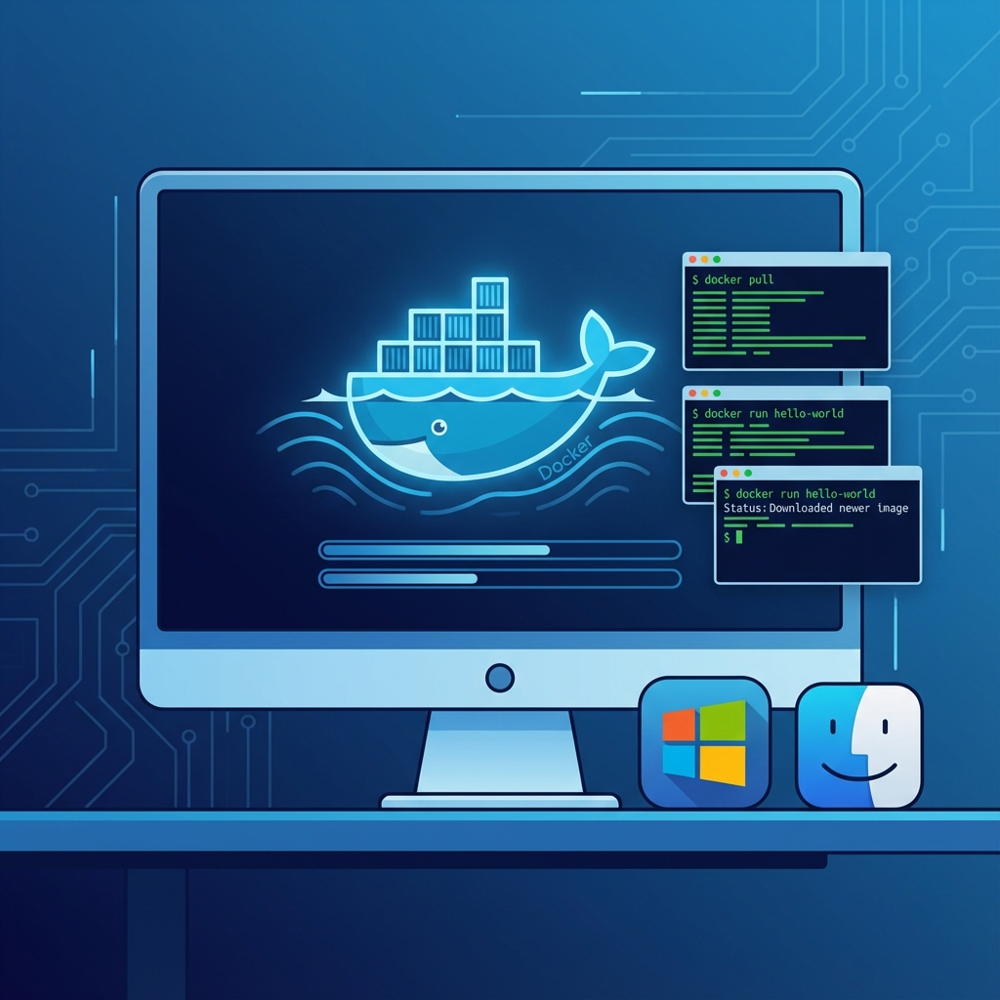

# 單元 1 - 本地安裝 Docker



> 🕐 預估時長：15 分鐘

## 學習目標

完成本單元後，您將能夠：
- 了解 Docker 的基本概念與用途
- 在本地環境安裝 Docker Desktop
- 驗證 Docker 是否正確運行

## 內容大綱

### 1. Docker 簡介
Docker 是一個開源的容器化平台，讓您可以將應用程式與其依賴環境打包在一起，確保在任何環境中都能一致地運行。

**為什麼 Dify 需要 Docker？**
- Dify 社群版需要多個服務協同工作（後端 API、資料庫、向量儲存等）
- Docker Compose 可以一鍵啟動所有服務
- 確保開發環境與生產環境一致

### 2. 安裝步驟

#### Windows 用戶
1. 前往 [Docker Desktop 官網](https://www.docker.com/products/docker-desktop/)
2. 下載 Windows 版本安裝程式
3. 執行安裝並重新啟動電腦
4. 確認 WSL 2 已啟用

#### macOS 用戶
1. 下載 Docker Desktop for Mac
2. 依據您的晶片選擇 Intel 或 Apple Silicon 版本
3. 拖曳至應用程式資料夾即可

### 3. 驗證安裝

開啟終端機，執行以下指令：
```bash
docker --version
docker compose version
```

若顯示版本號，代表安裝成功！

---

## 📝 課後小測驗

> [!QUIZ]
> **Q: 為什麼 Dify 社群版推薦使用 Docker 進行部署？**
> - [ ] 因為 Docker 是付費軟體
> - [x] 因為可以一鍵啟動所有需要的服務，確保環境一致性
> - [ ] 因為 Docker 可以讓電腦跑得更快

> [!QUIZ]
> **Q: 在 Windows 上安裝 Docker Desktop 需要先啟用什麼功能？**
> - [ ] Hyper-V 或 VirtualBox
> - [x] WSL 2 (Windows Subsystem for Linux 2)
> - [ ] .NET Framework
