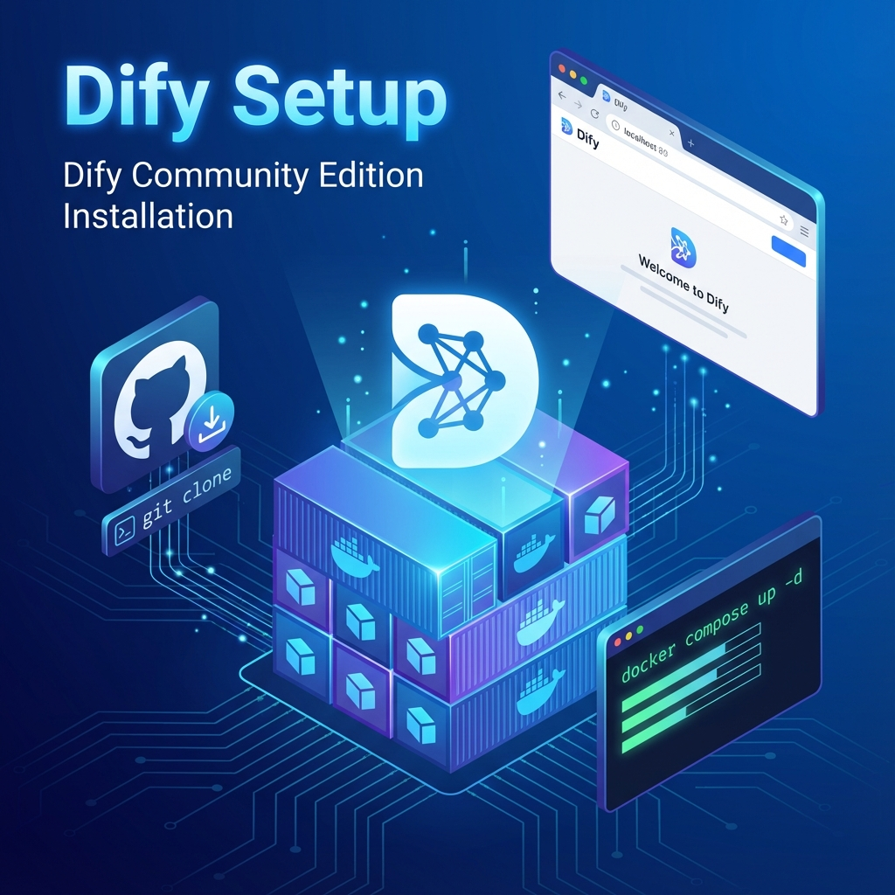

# 單元 2 - 安裝社群版 Dify



> 🕐 預估時長：20 分鐘

## 學習目標

完成本單元後，您將能夠：
- 從 GitHub 取得 Dify 社群版原始碼
- 使用 Docker Compose 啟動 Dify
- 完成初始化設定並登入管理介面

## 內容大綱

### 1. 取得 Dify 原始碼

開啟終端機，執行以下指令：
```bash
git clone https://github.com/langgenius/dify.git
cd dify/docker
```

### 2. 環境設定

複製環境變數範本：
```bash
cp .env.example .env
```

您可以在 `.env` 檔案中調整：
- `SECRET_KEY`：應用程式密鑰
- `CONSOLE_WEB_URL`：管理介面網址
- `SERVICE_API_URL`：API 服務網址

### 3. 啟動服務

使用 Docker Compose 啟動所有服務：
```bash
docker compose up -d
```

等待幾分鐘讓所有容器啟動完成。

### 4. 驗證安裝

開啟瀏覽器，前往 `http://localhost:80`

首次使用需要建立管理員帳號：
- 輸入您的 Email
- 設定密碼
- 完成 Dify 初始化！

---

## 📝 課後小測驗

> [!QUIZ]
> **Q: Dify 社群版的預設管理介面網址是？**
> - [ ] http://localhost:3000
> - [x] http://localhost:80
> - [ ] http://localhost:8080

> [!QUIZ]
> **Q: 啟動 Dify Docker 服務的指令是？**
> - [ ] docker start dify
> - [ ] docker run dify
> - [x] docker compose up -d
