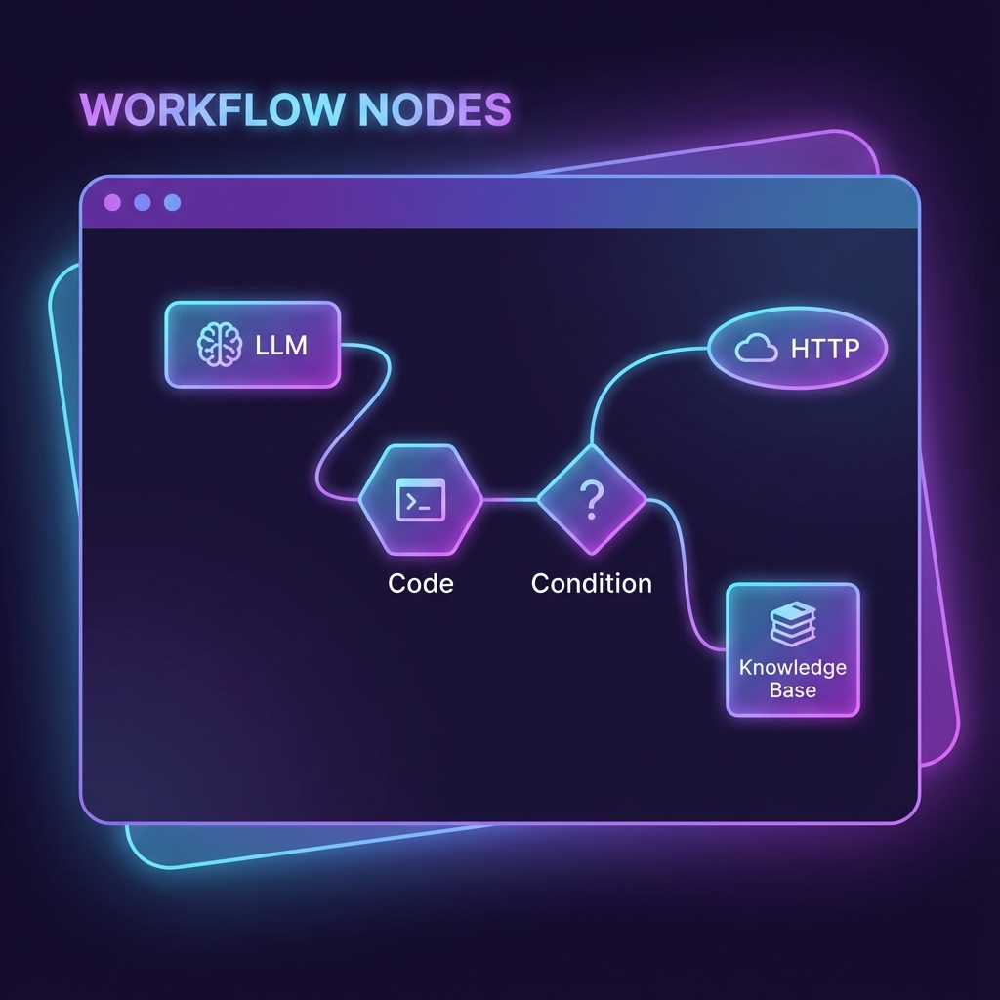

# 單元 5 - 工作流節點介紹

> 🕐 預估時長：20 分鐘

## 學習目標

完成本單元後，您將能夠：
- 區分「問題分類器 (Question Classifier)」與「條件分支 (Condition)」的適用場景
- 學會使用 AI 自動分類使用者意圖
- 掌握如何利用邏輯節點設計複雜的對話流程

## 內容大綱

### 1. 為什麼需要邏輯節點？

在簡單的應用中，我們可能只需要一個 LLM 節點就夠了。但在複雜的業務場景中，使用者的問題千奇百怪，我們不能用同一套 Prompt 回應所有人。

**邏輯節點的作用**：像交通警察一樣，指揮不同的問題走不同的路。

### 2. 問題分類器 (Question Classifier)

這是一個 **AI 驅動** 的分類工具。

- **原理**：利用 LLM 的語意理解能力，判斷使用者的意圖。
- **優點**：即使使用者用詞模糊，AI 也能猜出大概的意思。
- **缺點**：速度較慢（因為要呼叫模型），且需要消耗 Token。
- **適用場景**：客服分流、意圖識別（例如：區分「售後服務」、「產品諮詢」、「投訴」）。

**設定技巧**：
1. **模型選擇**：建議選擇速度快、便宜的模型 (如 Gemini Flash, GPT-3.5 Turbo)，因為分類任務通常不需要太強的推理能力。
2. **分類定義**：用自然語言描述每個分類的特徵（例如：「Class 1: 使用者詢問關於退貨的問題」）。

### 3. 條件分支 (Condition)

這是一個 **程式碼驅動** 的判斷工具。

- **原理**：類似程式設計中的 `if...else`，根據變數的值進行精確比對。
- **優點**：速度極快，不用錢。
- **缺點**：缺乏彈性，規則必須寫死。
- **適用場景**：數值判斷（年齡 > 18）、關鍵字比對（包含 "VIP"）、變數檢查（Is Empty）。

**邏輯運算**：
- **AND**：所有條件都必須成立。
- **OR**：只要有一個條件成立即可。

### 4. 實戰應用策略

在設計複雜工作流時，我們通常會結合兩者：

1. **先用「問題分類器」**：進行第一層的大方向分流（如：是「查詢」還是「閒聊」？）。
2. **再用「條件分支」**：進行第二層的精確控制（如：如果是查詢，檢查「會員等級」是否為 VIP？）。

---

## 📝 課後小測驗

> [!QUIZ]
> **Q: 如果我要設計一個流程，判斷使用者的年齡是否大於 18 歲，應該使用哪個節點？**
> - [ ] 問題分類器 (Question Classifier)
> - [x] 條件分支 (Condition)
> - [ ] LLM 節點

> [!QUIZ]
> **Q: 「問題分類器」背後是依賴什麼來運作的？**
> - [x] LLM (大語言模型)
> - [ ] Python 程式碼
> - [ ] 隨機數生成器

> [!QUIZ]
> **Q: 關於「條件分支」節點，以下敘述何者正確？**
> - [ ] 它需要消耗 Token
> - [ ] 它能理解模糊的語意
> - [x] 它的執行速度比問題分類器快
