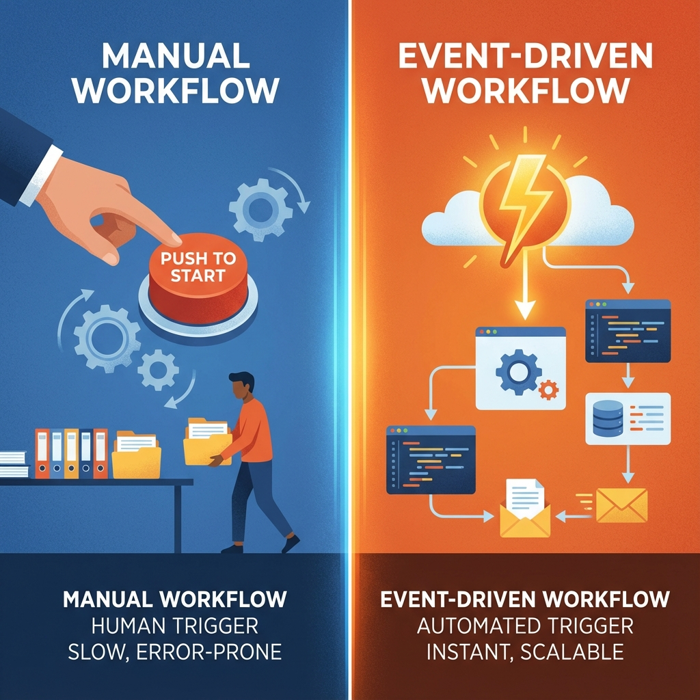

# 單元 6 - 手動驅動工作流 vs 事件驅動工作流

> 🕐 預估時長：15 分鐘

## 學習目標

完成本單元後，您將能夠：
- 理解「事件驅動 (Event-driven)」的概念與應用優勢
- 學會設定「排程 (Schedule)」觸發器來執行定時任務
- 掌握如何透過 Webhook 與 GitHub Trigger 連接外部服務

## 內容大綱

### 1. 兩種工作流模式

| 模式 | 一般工作流 (手動驅動) | 事件驅動工作流 (Trigger) |
| :--- | :--- | :--- |
| **啟動方式** | 人工點擊執行、或是透過 API 單次呼叫 | 系統自動偵測事件、時間到自動執行 |
| **主動性** | 被動 (等待指令) | 主動 (偵測環境變化) |
| **範例** | 文章產生器、翻譯工具 | 每日新聞推播、GitHub Issue 自動回覆 |

### 2. 關於觸發器 (Triggers)

Dify 支援多種觸發器，讓您的應用可以全天候自動運作。

#### ⏰ 排程 (Schedule / Cron)
- **用途**：定時執行任務。
- **設定**：
    - 設定頻率 (如：每天、每小時)。
    - 設定具體時間 (如：每天早上 09:00)。
- **應用**：每日財經摘要、定期清理資料庫、定時發送提醒。

#### 🔗 Webhook & GitHub Trigger
- **用途**：當外部系統發生特定事件時，通知 Dify 執行流程。
- **原理**：外部系統 (如 GitHub) 發送一個 HTTP 請求給 Dify 的 Webhook URL，Dify 收到後啟動工作流。
- **實戰案例 (GitHub Issue Bot)**：
    1. 在 Dify 設定 GitHub Trigger。
    2. 在 GitHub Repo 設定 Webhook。
    3. 當有人新增 Issue 時，GitHub 通知 Dify。
    4. Dify 自動讀取 Issue 內容，呼叫 LLM 進行分析或自動回覆。

### 3. 多重入口 (Parallel Execution)

Dify 的事件驅動工作流支援 **多重入口**。
- 您可以在同一個畫布置放多個不同的觸發器 (如：一個排程觸發、一個 Webhook 觸發)。
- 它們可以共用後面的處理邏輯，也可以各自走不同的流程。
- 這賦予了工作流極大的彈性，像是一個多功能的自動化中心。

---

## 📝 課後小測驗

> [!QUIZ]
> **Q: 如果我希望 Dify 每天早上自動幫我整理昨天的 Email 摘要，我應該使用哪種觸發器？**
> - [x] 排程 (Schedule)
> - [ ] Webhook
> - [ ] 手動執行

> [!QUIZ]
> **Q: Webhook 的主要作用是什麼？**
> - [ ] 讓 AI 可以上網
> - [x] 讓外部系統可以主動通知 Dify 執行任務
> - [ ] 用來備份資料庫

> [!QUIZ]
> **Q: 一個事件驅動工作流可以有多個觸發起點嗎？**
> - [x] 可以
> - [ ] 不行，只能有一個
