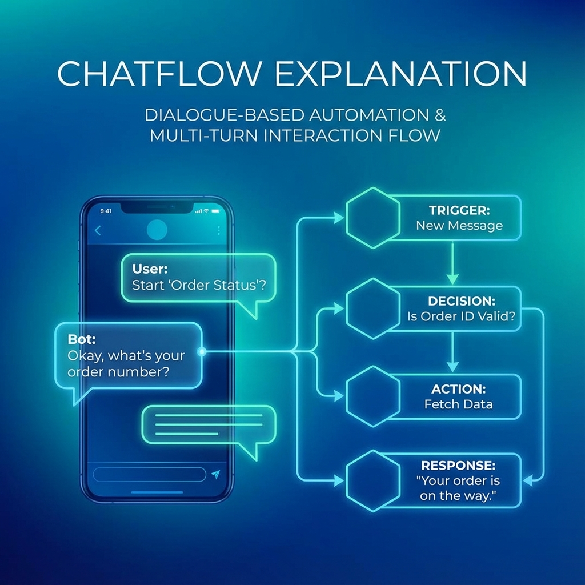

# 單元 7 - 聊天流說明

> 🕐 預估時長：20 分鐘

## 學習目標

完成本單元後，您將能夠：
- 深入理解「聊天流 (Chatflow)」的對話循環機制
- 掌握「對話變數 (Conversation Variables)」的設定與應用
- 設計具備「記憶能力」的智能對話機器人

## 內容大綱

### 1. 聊天流的核心特性

聊天流與工作流最大的差別在於 **「循環」** 與 **「記憶」**。

- **循環 (Loop)**：每次使用者發送訊息，整個流程就會從頭跑一次。
- **記憶 (Memory)**：為了讓機器人記得上一輪說過的話或查到的資料，我們需要特殊的儲存機制，這就是「對話變數」。

### 2. 必備節點：回覆 (Answer)

在工作流中，我們可以沒有輸出直接結束。但在聊天流中，**一定要有「回覆 (Answer)」節點**。
- 如果沒有回覆節點，使用者將看不到任何回應，系統也會報錯。
- 您可以在流程中的不同分支放置不同的回覆節點，讓機器人根據情境說不同的話。

### 3. 對話變數 (Conversation Variables)

這是讓 Chatflow 變聰明的關鍵。一般變數在流程結束後就會消失，但對話變數會 **跟著這個 Session (對話視窗) 一直存在**。

**實戰應用：記住使用者的名字**

1. **設定變數**：在 Conversation Variables 區域新增一個 `user_name` 變數。
2. **第一輪對話**：
    - 機器人檢查 `user_name` 是否為空？
    - 是 -> 詢問：「請問怎麼稱呼您？」
    - 使用者回答：「我是 Kevin」。
    - **寫入變數**：利用「變數賦值 (Variable Assigner)」節點，將 "Kevin" 存入 `user_name`。
3. **第二輪對話**：
    - 機器人檢查 `user_name` 是否為空？
    - 否 (因為已經存了 Kevin) -> 直接回答：「Kevin 您好，有什麼我可以幫您的嗎？」

透過這個機制，我們就能創造出有延續性體驗的 AI 應用，而不是每次都像失憶一樣重頭問起。

### 4. 複雜流程設計建議

對於需要多輪互動的場景（如：訂房系統、導診系統），建議：
1. 先畫出流程圖 (Flowchart)。
2. 定義好每一個階段需要的「狀態標記」 (Flag)。
3. 利用對話變數來儲存這些 Flag，控制流程的走向。

---

## 📝 課後小測驗

> [!QUIZ]
> **Q: 在聊天流中，為什麼需要「對話變數 (Conversation Variables)」？**
> - [ ] 為了增加運算速度
> - [x] 為了在不同的對話回合間保存資料 (如使用者姓名、訂單狀態)
> - [ ] 為了讓介面比較好看

> [!QUIZ]
> **Q: 聊天流 (Chatflow) 必須包含哪一個節點，否則會報錯？**
> - [ ] HTTP 請求
> - [ ] 知識庫檢索
> - [x] 回覆 (Answer)

> [!QUIZ]
> **Q: 當使用者發送新訊息時，Chatflow 的流程會怎麼執行？**
> - [ ] 從上一次結束的地方繼續
> - [x] 從頭開始重新執行整個流程
