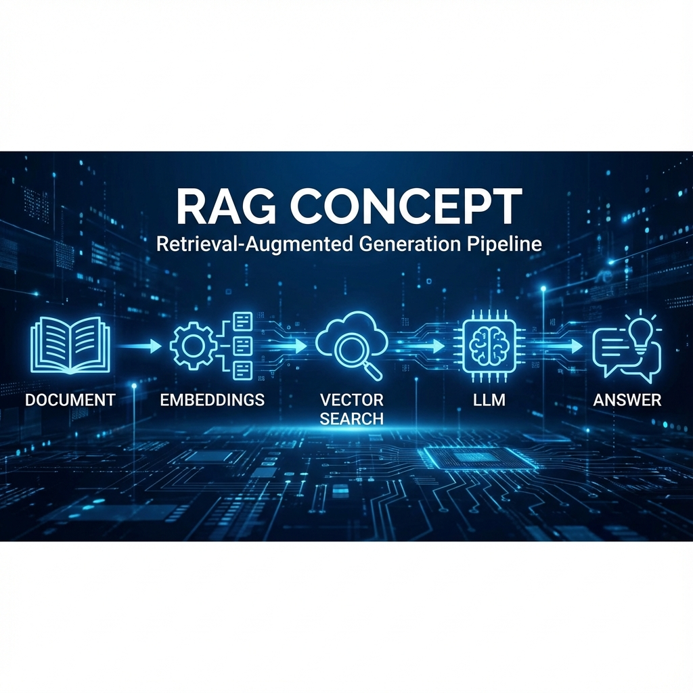

# 單元 1 - RAG 概念

> 🕐 預估時長：10 分鐘

## 學習目標

完成本單元後，您將能夠：
- 理解 RAG (檢索增強生成) 如何解決 AI 幻覺與知識過時問題
- 掌握 RAG 的運作三階段：檢索 (Retrieval)、增強 (Augmentation)、生成 (Generation)
- 了解 ETL (Extract, Transform, Load) 在知識庫建置中的角色

## 內容大綱

### 1. 為什麼需要 RAG？
大語言模型 (LLM) 雖然強大，但有三個致命傷：
1.  **知識過時**：訓練資料有截止日期 (Knowledge Cutoff)，不知道最近發生的新聞。
2.  **幻覺 (Hallucination)**：遇到不知道的問題，可能會一本正經地胡說八道。
3.  **私有數據**：AI 不知道你公司的內部文件或個人筆記。

**RAG (Retrieval-Augmented Generation)** 就是為了這解決這三大問題而生。它就像是給 AI 一本「參考書」，讓它在回答問題前先去翻書，根據書上的內容回答。

### 2. RAG 的運作流程

RAG 的運作可以簡單分為三個步驟：

1.  **檢索 (Retrieval)**：
    -   當使用者問問題時，系統先去「知識庫」中搜尋相關的資料片段。
    -   這需要先做好 **ETL**：將文件拆解 (Chunking) -> 向量化 (Embedding) -> 存入向量資料庫。
2.  **增強 (Augmentation)**：
    -   將使用者的問題 + 找出來的資料片段，組合成一個全新的 Prompt。
    -   Prompt 範例：「請根據以下資料回答問題...[資料片段]...問題：[使用者問題]」。
3.  **生成 (Generation)**：
    -   將增強後的 Prompt 丟給 LLM，讓它生成最終答案。

### 3. Dify 的知識庫功能
在 Dify 中，建立 RAG 應用非常簡單：
- 不需要自己寫程式做 ETL。
- 不需要自己架設向量資料庫。
- 只要在介面上「上傳檔案」，Dify 就會自動幫您完成切片、向量化與儲存的動作。

---

## 📝 課後小測驗

> [!QUIZ]
> **Q: RAG 主要用來解決大語言模型的哪一個問題？**
> - [ ] 運算速度太慢
> - [x] 知識過時與幻覺問題
> - [ ] 無法產生圖片

> [!QUIZ]
> **Q: 在 RAG 的流程中，「檢索 (Retrieval)」的主要目的是什麼？**
> - [ ] 生成最終答案
> - [ ] 將使用者的問題翻譯成英文
> - [x] 從知識庫中找出與問題相關的資料片段
