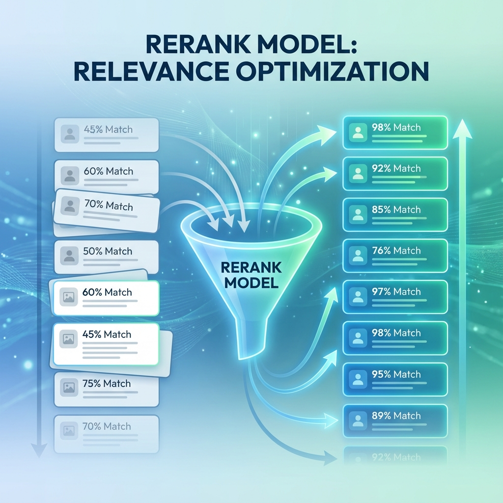

# 單元 3 - 傳統模式進行檔案上傳及測試

> 🕐 預估時長：20 分鐘

## 學習目標

完成本單元後，您將能夠：
- 熟悉 Dify 知識庫的檔案上傳限制與解決方案
- 掌握「分段 (Chunking)」設定對搜尋效果的影響
- 學會使用「混合檢索 (Hybrid Search)」提升召回率

## 內容大綱

### 1. 檔案上傳限制
-   **雲端版限制**：單一檔案最大 **15MB**。
-   **解決方案**：
    1.  分割檔案後再上傳。
    2.  改用 **Self-hosted (私有部署)** 版本，修改環境變數 (如 `NGINX_CLIENT_MAX_BODY_SIZE`)，可支援到 100MB 甚至更大。

### 2. 分段設定 (Chunk Settings)

分段是 RAG 效果好壞的關鍵。

-   **分段最大長度 (Max Chunk Length)**：
    -   建議值：**500 ~ 1024** Tokens。
    -   **太小**：容易切斷語意，導致資料破碎。
    -   **太大**：包含太多雜訊，且 Embedding 模型可能抓不到重點。
-   **重疊長度 (Overlap)**：
    -   建議值：**10% ~ 20%** (如 50-100 Tokens)。
    -   **目的**：確保切分點附近的語意能被延續，避免關鍵字剛好被切斷。

### 3. 檢索模式 (Retrieval Mode)

Dify 提供三種模式，**強烈建議使用「混合檢索」**：

1.  **向量檢索 (Vector Search)**：用 Embedding 找語意相似。適合模糊搜尋。
2.  **全文檢索 (Full-text Search)**：用關鍵字找完全匹配。適合專有名詞搜尋。
3.  **混合檢索 (Hybrid Search)**：**向量 + 全文** 同時進行，再透過 Rerank 重新排序。這是目前業界公認效果最好的做法。

### 4. 實戰測試技巧

在知識庫建立完成後，不要急著用。請先在右側的 **「命中測試 (Retrieval Test)」** 輸入幾個問題：
-   觀察回傳的片段是否包含正確答案？
-   觀察 Rerank 分數與信心度。
-   如果分數過低 (如 < 0.5)，可能需要調整分段設定或更換模型。

---

## 📝 課後小測驗

> [!QUIZ]
> **Q: 在 Dify 雲端版中，單一檔案上傳的大小限制是多少？**
> - [x] 15 MB
> - [ ] 100 MB
> - [ ] 無限制

> [!QUIZ]
> **Q: 關於「混合檢索 (Hybrid Search)」，以下敘述何者正確？**
> - [ ] 它只使用關鍵字搜尋
> - [ ] 它只使用向量搜尋
> - [x] 它同時結合了關鍵字搜尋與向量搜尋的優點，通常效果最好

> [!QUIZ]
> **Q: 設定「重疊長度 (Overlap)」的主要目的是什麼？**
> - [ ] 增加檔案大小
> - [x] 避免關鍵資訊剛好在切分點被切斷，保持語意連貫
> - [ ] 浪費 Token
