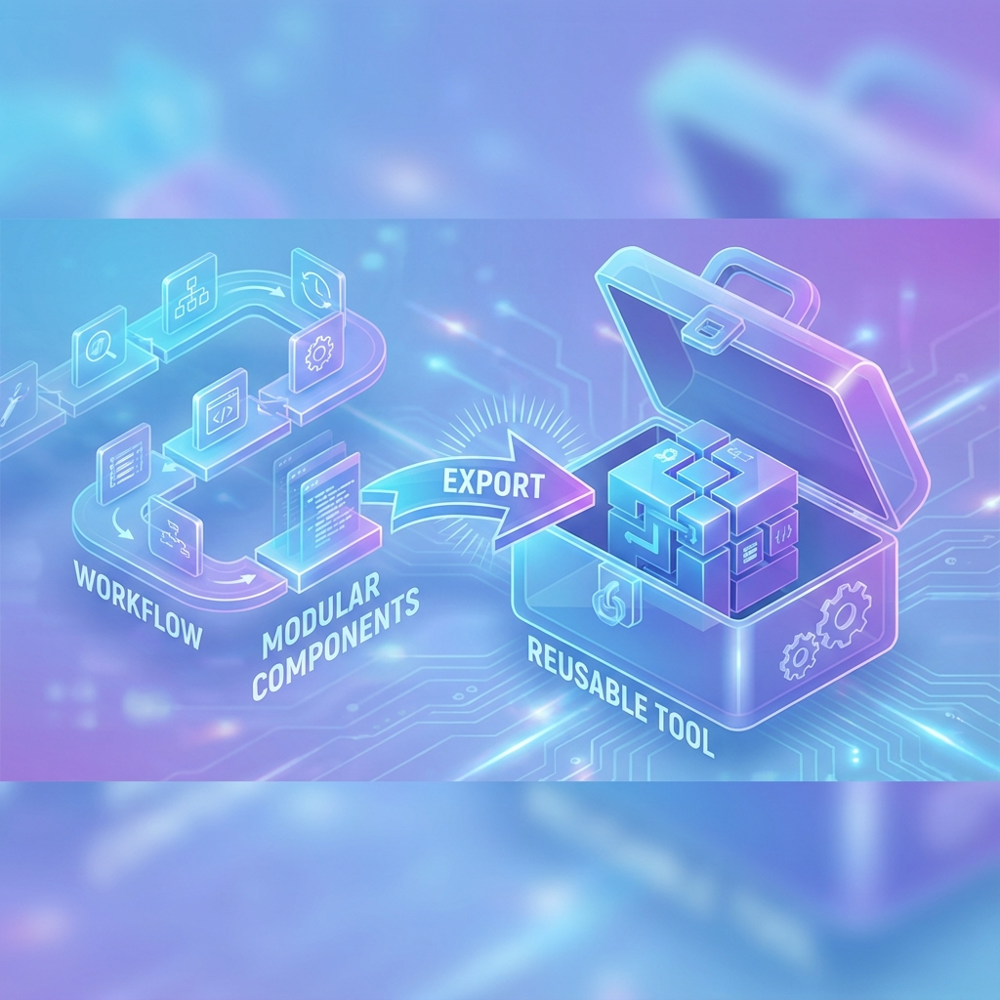

# 單元 1 - 將流程匯出成工具

> 🕐 預估時長：10 分鐘

## 學習目標

完成本單元後，您將能夠：

- 理解將 Dify 流程 (Workflow) 封裝為自定義工具的好處與應用場景
- 掌握將現有工作流程發布、匯出成為工具 (Tool) 的完整步驟
- 能夠在其他流程中調用已發布的流程工具

## 內容大綱

### 1. 為什麼要將流程匯出成工具？

在 Dify 中，工作流 (Workflow) 可以實現非常複雜的邏輯（例如：連續呼叫多個 API、長文本總結、意圖分類與分流處理等）。如果我們想在「對話型 Agent」中運用這些複雜邏輯，最快且最簡潔的方法就是將 Workflow **匯出為工具 (Export as Tool)**。

- **模組封裝**：將複雜的工作邏輯封裝起來，讓 Agent 只需要負責思考與呼叫，無需了解背後的複雜運作。
- **高重用性 (Reusability)**：一個建立好的工作流，可以匯出提供給多個不同的 Agent AI 助手當作外掛使用。

### 2. 匯出工具的主要步驟

將流程變成工具非常簡單，只需三個核心步驟：

1. **設定明確的輸入與輸出**：確保工作流開始節點 (Start) 的參數定義清楚，並妥善規劃結束節點 (End)，以定義工具到底會回傳什麼結果給 Agent。
2. **填寫詳細工具說明**：在右上角的地方為這個工具命名並撰寫清晰的描述 (Description)。**這非常重要，因為大型語言模型 (LLM) 完全是依據這段描述來判斷何時該調用您的工具！**
3. **發布為工具**：在網頁的發布選項中，選擇將其匯出成工具 (Publish as Tool)。

### 3. 測試與實際應用

匯出完成後，您可以在任何聊天或 Agent 應用的「擴展/工具」介面中，找到您剛剛發布的工作流。掛載後，Agent 系統就能在對話過程中，自動分析使用者的需求，並觸發這個原本獨立的工作流程！

---

## 📝 課後小測驗

> [!QUIZ]
> **Q: 將流程匯出成工具前，最重要的準備工作是什麼？**
>
> - [ ] 撰寫 HTML 介面來呈現它
> - [X] 設定清晰的輸入 (Start) 參數與定義好輸出回傳值 (End)
> - [ ] 先購買付費版帳號

> [!QUIZ]
> **Q: 在設定工具時，為什麼填寫清晰完整的「工具說明 (Description)」極度重要？**
>
> - [ ] 因為這是系統強制的防呆機制
> - [ ] 寫給開發團隊方便日後交接與維護
> - [X] 因為 AI 模型只能靠這段文字來判斷使用者的問題是否需要呼叫這個工具
