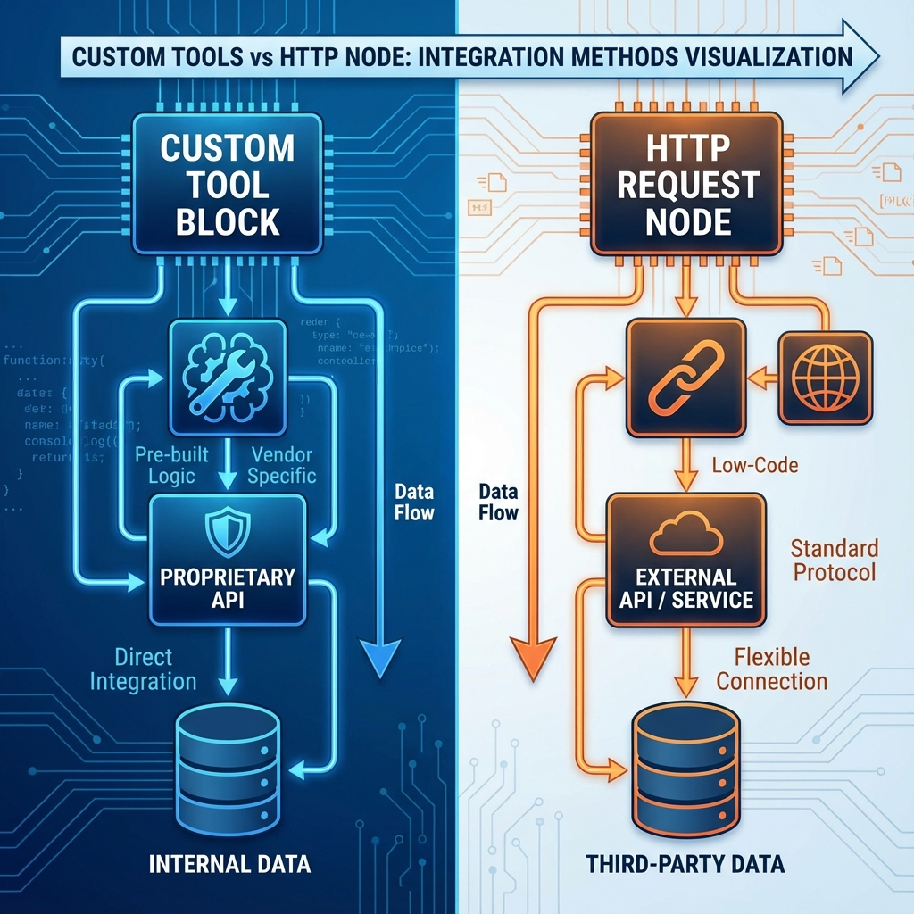

# 單元 2 - 自定義工具與 HTTP 節點的差別

> 🕐 預估時長：15 分鐘

## 學習目標

完成本單元後，您將能夠：

- 了解 HTTP 節點的適用場景與優缺點
- 了解自定義工具 (Custom Tool) 的適用場景與優缺點
- 根據您的需求（Agent 或 Workflow），選擇最合適的方式串接外部服務

## 內容大綱

在 Dify 的工作流 (Workflow) 或智能體 (Agent) 中，當我們需要調用外部的 API 服務時，Dify 提供了兩種主要方式：**HTTP 節點 (HTTP Request Node)** 和 **自定義工具 (Custom Tool)**。

這兩者的目的都是為了與外部系統溝通，但是其設計理念、適用場景和配置複雜度有顯著的差異。以下將詳細介紹這兩種實現方式的差別。

### 1. HTTP 節點 (HTTP Request Node)

HTTP 節點是 Dify 工作流中最基礎的網絡連線節點。它允許我們在工作流中的某一個固定步驟，發送一個標準的 HTTP 請求（如 GET, POST, PUT, DELETE）到外部伺服器，並取得返回的結果。

- **特性**：固定流程（非 LLM 決策）、手動解析返回資料。
- **優點**：簡單直覺，只需知道 API Endpoint 即可快速串接；對於簡單的單一 API 呼叫非常方便。
- **缺點**：如果外部 API 具有複雜的層級結構，處理起來會相對繁瑣；這對 Agent (智能體) 並不友善，無法讓 LLM 自動決定何時呼叫。

### 2. 自定義工具 (Custom Tool)

自定義工具是讓 LLM (特別是 Agent) 具備「行動能力」的核心機制。在 Dify 中，自定義工具通常是基於 OpenAPI (Swagger) 規範來定義的。一旦配置好，您可以將這個工具配備給 Agent 或工作流。

- **特性**：自主決策 (Agentic Behavior)、基於 OpenAPI 規範自動解析、高度模組化與重用性。
- **優點**：非常適合 Agent 應用，能大幅擴展語言模型的能力；設定一次即可到處重用；自動解析參數結構。
- **缺點**：前置作業較為繁瑣，必須準備正確且符合規範的 OpenAPI Schema。

### 3. 核心差異比較表

| 比較項目 | HTTP 節點 (HTTP Request) | 自定義工具 (Custom Tool) |
| :--- | :--- | :--- |
| **觸發方式** | **強制觸發**（工作流執行到該步驟時必定觸發） | **自主觸發 / 工作流調用**（由 LLM 決定是否觸發，或在工作流中作為節點調用） |
| **配置方式** | 逐項手動填寫 URL、Method、Headers、Body | 匯入 OpenAPI (Swagger) Schema 自動解析 |
| **適用應用類型** | 工作流 (Workflow / Chatflow) | 智能體 (Agent)、工作流 (Workflow / Chatflow) |
| **資料解析** | 需手動處理或透過代碼節點解析 JSON | 系統自動解析，可以直接對應到後續變數 |
| **重用性** | 低（僅存在於當前節點，其他地方要用需複製或重寫） | **高**（註冊為 Workspace 層級的工具，任何應用皆可裝備） |

### 4. 實務選擇指南

✅ **請選擇 HTTP 節點，如果：**
1. 您正在撰寫一個**固定流程的工作流**（Workflow）。
2. 發送通知、推送報告等無需 LLM 決策的動作。
3. 您只有一個簡單的 API 且沒有其 Schema 檔案。

🚀 **請選擇自定義工具，如果：**
1. 您正在開發一個 **Agent (智能體)**，並希望將此功能變成 AI 的「技能」。
2. 這個服務包含多個複雜的 Endpoints。
3. 預期未來會**頻繁地被多個不同的應用程式重複使用**。

---

## 📝 課後小測驗

> [!QUIZ]
> **Q: 當你正在打造一個「個人助理 Agent」，希望它能根據對話判斷是否要幫你查天氣。你應該用哪一種方式來串接天氣 API？**
>
> - [ ] HTTP 節點
> - [x] 自定義工具
> - [ ] 隨便都可以

> [!QUIZ]
> **Q: 以下哪個敘述符合「HTTP 節點」的特性？**
>
> - [ ] 可以在不同的應用間輕鬆重用共用設定
> - [x] 屬於固定流程的觸發，走到該節點就一定會發出網呼叫
> - [ ] 讓 AI 決定到底要不要呼叫
