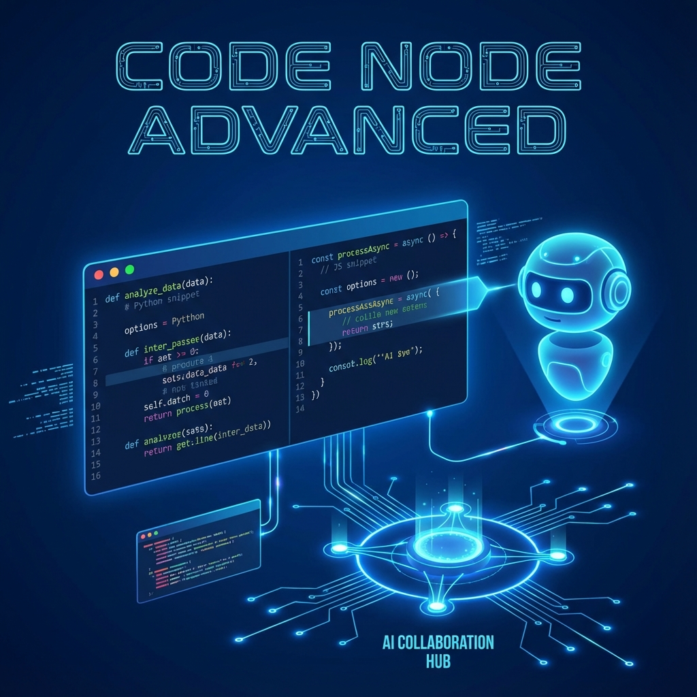

# 單元 3 - 代碼節點進階應用：讓 AI 協助完成簡易代碼



> 🕐 預估時長：15 分鐘

## 學習目標

完成本單元後，您將能夠：

- 認識代碼節點 (Code Node) 在工作流中的定位與功能
- 理解 Dify 代碼沙箱的環境限制
- 學習如何透過 AI 提示詞 (Prompt) 快速生成能直接在 Dify 中運行的程式碼

## 內容大綱

在開發 AI 應用時，經常會遇到單純用語意理解無法精準處理的結構化數據或邏輯運算。在 Dify 的工作流 (Workflow) 或 Chatflow 當中，**代碼節點 (Code Node)** 是用來處理這類問題的利器。

### 1. 為什麼需要代碼節點？

雖然大型語言模型（LLM）非常強大，但在以下情境下，傳統代碼的表現會比 LLM 更穩定、更便宜、且速度更快：
1.  **資料格式轉換**：例如將外部 API 返回的 JSON 陣列，轉換成以逗號分隔的純字串。
2.  **字串處理與正則表達式**：去除多餘的空白、擷取特定的身份證字號或信箱。
3.  **數學運算**：精確的加減乘除或日期時間計算。
4.  **條件邏輯判斷**：基於多個變數進行複雜的 if/else 判斷，並輸出一個布林值供工作流後續的「條件分支節點」使用。

### 2. Dify 中的代碼環境

Dify 內建了一個安全隔離的沙箱 (Sandbox) 環境來執行代碼，目前支援兩種語言：
*   **Python 3**
*   **Node.js (JavaScript)**

> ⚠️ **注意**：出於安全性考量，沙箱環境通常**不允許**執行網路請求 (如 `fetch` 或 `requests`) 和檔案系統操作。如果有網路請求需求，請改用 HTTP 節點或自定義工具。
> 在 Dify 中，代碼節點必須包含一個 `main` 函數，負責接收輸入變數並返回一個字典 (Dictionary/Object) 作為輸出。

### 3. 讓 AI 協助撰寫代碼

很多不會寫程式的用戶也能順利使用代碼節點，秘訣就在於**讓 AI 幫你寫程式碼**！

你可以使用 ChatGPT、Claude 或 Cursor，並給予它們類似這樣的提示詞 (Prompt)：

```text
我正在使用 Dify 的代碼節點，運行環境是 Python 3。
請幫我寫一個名為 main 的函數，接收參數 `args`（這是一個字典）。
其中 `args` 裡會有一個鍵叫做 `raw_text`，包含一段長文章。

請幫我實現以下功能：
1. 找出文章中所有符合 E-mail 格式的字串。
2. 將這些 E-mail 取出，並用逗號拼接成一個單一字串。
3. 函數最後必須回傳一個字典，格式為 `{"emails": "結果字串"}`。

請注意 Dify 沙箱的限制，不要使用任何需要額外安裝或是會發送網路請求的套件。
```

拿到程式碼後，將其貼入 Dify 的代碼節點，並在介面上定義好輸入與輸出的變數，即可完美運行！

---

## 📝 課後小測驗

> [!QUIZ]
> **Q: 在 Dify 的代碼節點沙箱中，我們主要是受到什麼限制？**
>
> - [x] 不能隨意發送網路請求或存取檔案系統
> - [ ] 只能寫不超過 10 行的代碼
> - [ ] 不支援 Python 語言

> [!QUIZ]
> **Q: 針對數學運算（例如：2348 乘上 57），使用「代碼節點」相比「LLM 節點」最大的優勢是？**
>
> - [ ] 代碼比較潮
> - [x] 代碼計算速度更快、成本更低且保證 100% 精確
> - [ ] LLM 太笨完全不會算數
