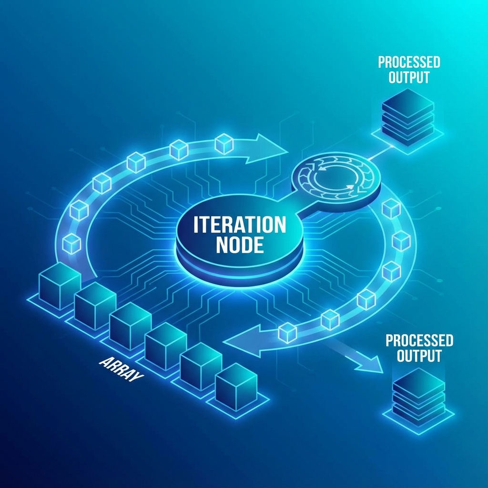

# 單元 5 - 迭代節點進階應用：完成重複性工作

> 🕐 預估時長：10 分鐘

## 學習目標

完成本單元後，您將能夠：

- 認識迭代節點 (Iteration Node) 的用途與邊界限制
- 學會如何在陣列資料上執行重複的子流程
- 利用迭代節點進行批次處理（例如：批次翻譯、爬取多行網址）

## 內容大綱

在自動化工作流程中，我們經常會遇到需要「對一組清單中的每一個項目執行相同動作」的情況。在 Dify 工作流中，這項任務就是由 **迭代節點 (Iteration Node)** 來完成。

### 1. 什麼是迭代節點？

迭代節點就像是程式語言中的 `for...each` 迴圈。它必須接收一個 **數組 (Array / List)** 作為輸入參數。
在迭代節點內部，您可以建立一個小型的「子流程」。迭代節點會把數組裡面的元素「一個一個」拿出來，依序送入這個子流程中執行。當所有的元素都被處理完畢後，迭代節點才會將所有的結果彙整成一個新的數組，並傳遞給下一個主流程節點。

**常見應用場景**：
1.  **批次翻譯 / 摘要**：輸入包含 10 個英文段落的陣列，在迭代節點內放一個 LLM 節點負責翻譯成中文。輸出會是 10 個中文段落的陣列。
2.  **批次爬蟲**：輸入一個包含 5 個網址的清單，在迭代內部使用 HTTP 節點或爬蟲工具抓取每一個網址的內容，最後彙整成 5 篇文章的資料集。
3.  **批次審核**：讀取一組使用者留言，逐一交給審核模型判斷是否有不雅字眼。

### 2. 迭代節點的運作機制與限制

**運作順序**
在 Dify 目前的版本中，迭代節點內部的執行是**循序執行 (Sequential)** 的。意味著必須等第一個元素完全跑完子流程，才會開始跑第二個元素。如果清單很長或者子流程包含耗時的網路請求 / LLM 生成，整個工作流可能會執行得相對較久。

**輸入與輸出**
*   **輸入必須是 Array**：要啟動迭代節點，您必須從上游節點提供一個陣列（例如：`["A", "B", "C"]` 或 `[{"id": 1}, {"id": 2}]`）。如果上游節點提供的是字串，您必須先透過「代碼節點」將其轉換為陣列格式。
*   **輸出也是 Array**：子流程的最後一個節點（通常被標記為迭代結束）所吐出的變數，會被蒐集成一個新的陣列傳遞往下游。

### 3. 內部變數的取用

在迭代的子流程內部，您會看到一個特殊的內建變數 `item`。這個變數代表「當下正在被處理的這一個元素」。因此在子流程內的 HTTP 或 LLM 節點，請記得去引用這個 `item` 作為輸入。

掌握迭代節點，您就能輕鬆讓 Dify 為您處理繁瑣的大量重複任務，大幅提升自動化效率！

---

## 📝 課後小測驗

> [!QUIZ]
> **Q: 要將資料餵給迭代節點執行，你的輸入變數必須是哪種類型的資料格式？**
>
> - [ ] 純文字 (String)
> - [x] 陣列/數組 (Array)
> - [ ] 數字 (Number)

> [!QUIZ]
> **Q: 在迭代節點的子流程中，代表「當下這一次迴圈抓到的那筆資料」的預設變數名稱為何？**
>
> - [ ] `current`
> - [ ] `element`
> - [x] `item`
