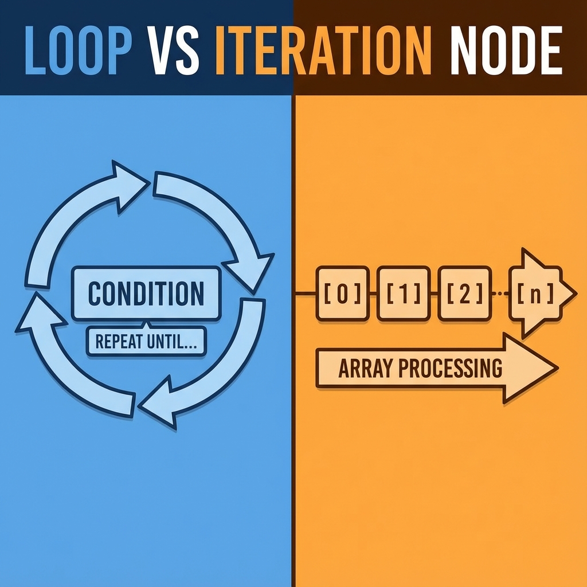

# 單元 6 - 循環節點與迭代節點的差異：能用來做甚麼？

> 🕐 預估時長：10 分鐘

## 學習目標

完成本單元後，您將能夠：

- 清楚分辨「迭代節點 (Iteration)」與「循環節點 (Loop)」本質上的差異
- 面對不同的業務用例，正確選擇該用哪種重複執行方式
- 認識常見的循環節點應用（例如分頁抓取、狀態輪詢等）

## 內容大綱

在 Dify 的進階工作流設計中，**迭代節點 (Iteration)** 和 **循環節點 (Loop / While)** 都會重複執行某一段子流程。但它們的核心邏輯與適用場景截然不同。理解這兩者的差異，是設計出靈活且穩定工作流的關鍵。

### 1. 核心差異比較表

| 比較項目 | 迭代節點 (Iteration Node) | 循環節點 (Loop Node) |
| :--- | :--- | :--- |
| **執行次數** | **固定已知**。取決於輸入陣列 (Array) 的元素數量。 | **未知**。取決於設定的「中斷條件」何時滿足。 |
| **觸發方式** | 對陣列中的每一個元素，依序執行一次。 | 反覆執行同一個流程，直到滿足特定條件才停止。 |
| **程式語言類比** | `for...each` 或 `map()` | `while (condition) { ... }` 或 `do...while` |
| **常見應用場景**| 批次處理、列表項展開。 | 狀態輪詢、重試機制、分頁 API 抓取。 |

### 2. 迭代節點的專長：批次處理

如前一個單元所述，迭代節點的目的是「遍歷」。

**👉 何時使用：**
*   您已經有一份清單（例如：5 篇文章的 URL、10 個使用者的 ID）。
*   您需要對這份清單上的每一個項目做同樣的事情。
*   **範例**：將一篇長文拆分成 10 個段落放在陣列中，然後用 LLM 迭代翻譯這 10 個段落，最後合併。

### 3. 循環節點的專長：條件控制

循環節點的特點是，在進入下一次循環前，它會檢查您設定的判斷條件。只要條件成立（或不成立，取決於您的設定），它就會繼續重複執行。

**👉 何時使用：**
*   您**不知道需要執行幾次**，只能靠結果來判斷是否該停下來。
*   **應用場景範例：**
    1.  **非同步任務輪詢 (Polling)**：呼叫一個外部轉檔 API 後，對方回傳了一個 Task ID。我們可以使用循環節點，每隔 5 秒發送一次 HTTP 請求查詢進度，**直到 (Until)** 狀態變為 `completed` 或 `failed` 時才結束循環。
    2.  **API 分頁抓取 (Pagination)**：爬取某個網站的商品列表，每次抓 100 筆。在循環節點內判斷：如果回傳的 `has_next_page` 欄位為 `true`，就將 `page_number` 加 1 繼續抓下一頁；如果為 `false`，則停止抓取並匯出所有商品。
    3.  **錯誤重試 (Retry)**：當呼叫不穩定的第三方服務失敗時，設計一個重試機制，最多重跑 3 次。

### 4. 總結

簡單來說：如果您手上有一個具體的清單需要「一個一個消耗掉」，請用**迭代節點**。如果您需要 AI / 工作流「一直試，直到達成某個目標為止」，請用**循環節點**。

---

## 📝 課後小測驗

> [!QUIZ]
> **Q: 今天需要實作一個「定時去查詢某個第三方網站，只要對方訂單狀態還不是已出貨，就等五分鐘再查一次」的情境，應該使用哪一個節點？**
>
> - [x] 循環節點 (Loop / While)
> - [ ] 迭代節點 (Iteration)
> - [ ] 代碼節點 (Code)

> [!QUIZ]
> **Q: 接續上題，為什麼不選另一個節點呢？**
>
> - [ ] 因為迭代節點運行比較慢
> - [x] 因為迭代節點需要提前給予固定長度的陣列，但我們無法預知對方什麼時候會出貨（執行次數未知）
> - [ ] 因為迭代節點不支援連接外部網站
