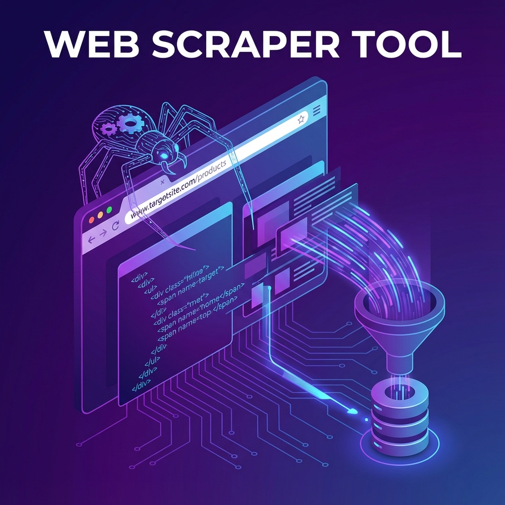

# 單元 7 - 網路爬蟲工具應用



> 🕐 預估時長：15 分鐘

## 學習目標

完成本單元後，您將能夠：

- 認識 Dify 內建支援的各種爬蟲與搜尋擴充功能
- 學會選擇合適的爬蟲工具套用於不同情境（Jina Reader vs Firecrawl）
- 了解爬蟲中常見的陷阱（反爬阻擋、動態網頁、Token 爆炸）與解法

## 內容大綱

在大語言模型 (LLM) 的應用場景中，知識的新鮮度與來源的廣泛度是非常重要的。為了讓您的 Dify AI 能夠「上網查資料」，您需要使用網路爬蟲工具。

Dify 內建或支援了多種強大的爬蟲與網頁讀取工具，本單元將介紹其基礎應用與常見技巧。

### 1. 常見的爬蟲工具與擴展

在 Dify 中，您可以透過 **工具 (Tools)** 頁籤來啟用或配置這些功能：

1.  **Jina Reader**：
    *   **用途**：將任何 URL 轉換成 LLM 易於閱讀的 Markdown 格式。
    *   **優點**：非常簡單，免費額度高，對純文本網頁解析良好。
2.  **Firecrawl**：
    *   **用途**：專為 LLM 打造的強大爬蟲，不僅能讀取單一頁面，還支援整站爬取 (Crawl) 及搜尋。
    *   **優點**：能夠很好地處理 JavaScript 動態渲染的網頁、突破常見的反爬蟲機制，並輸出乾淨的 Markdown 或結構化資料 (JSON)。適合複雜或需要深度抓取的場景。
3.  **EXA**：
    *   **用途**：讓 AI 具備更具彈性的搜尋引擎與檢索能力。
    *   **用法**：通常會先用語意搜尋找到一堆 URL，再搭配 Jina Reader 或 Firecrawl 去抓取那些 URL 的詳細內容。

### 2. 如何在 Dify 工作流中使用爬蟲？

1.  **透過 Agent 自主決定 (推薦)**：
    將「網頁內容擷取 (Web Scraper)」或「Firecrawl」工具配置給 Agent。當您問：「請幫我總結這個網址的內容：https://example.com」，Agent 會自動調用工具去抓取。
2.  **固定工作流 (Workflow)**：
    在 Workflow 中新增一個「工具節點」，選擇爬蟲工具，並將上游（例如開始節點）傳過來的 URL 作為輸入參數。爬蟲抓完後的純文字 (Markdown 格式)，可以直接用線條連給後面的 LLM 節點，並在 Prompt 中寫入：
    ```text
    請根據以下網頁內容，撰寫一篇 500 字的總結：
    {{ scraper.text }}
    ```

### 3. 常見挑戰與應對策略

1.  **遇到反爬蟲阻擋 (403 Forbidden / CAPTCHA)**：
    有些網站（如推特、大型電商）防護嚴格。這時簡單的 HTTP 節點一定會失敗，您必須升級使用 Firecrawl 等具有無頭瀏覽器 (Headless Browser) 和代理 IP 能力的高階服務。
2.  **JavaScript 動態網頁空白**：
    如果抓回來的內容只有 `<div id="root"></div>`，代表該網頁是透過 JS 渲染的 (如 React, Vue)。請確保爬蟲工具開啟了 JS 渲染功能。
3.  **大內容量超出 Token 上限**：
    如果抓取的網頁是一本幾萬字的電子書，直接塞給 LLM 會超過 Token 限制，甚至導致錯誤。
    *   **解法**：先透過工作流將長文本進行切片，或分段交由「迭代節點」處理；若是固定參考資料，建議先上傳至 Dify 的「知識庫 (Knowledge)」建立向量索引，而不是每次即時爬取。

---

## 📝 課後小測驗

> [!QUIZ]
> **Q: 有些現代化網站（例如使用 React 製作的單頁網頁），使用純 HTTP 請求去抓取可能會抓不到實質內容，這時候應該挑選哪一種爬蟲方案？**
>
> - [x] 使用具備 JavaScript 渲染能力的爬蟲（如 Firecrawl）
> - [ ] 使用簡單的 HTTP Get 節點即可
> - [ ] 不要爬這種網頁，無解

> [!QUIZ]
> **Q: 為了讓大語言模型 (LLM) 更能看懂爬蟲抓下來的網頁原始碼，最常推薦將 HTML 轉換為哪種格式？**
>
> - [ ] PDF
> - [ ] XML
> - [x] Markdown
