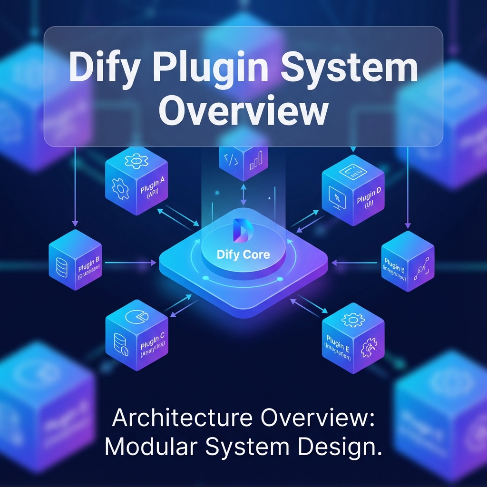

# 單元 1 - Dify 插件系統概述

> 🕐 預估時長：15 分鐘

## 學習目標

完成本單元後，您將能夠：

- 認識 Dify 原生插件 (Plugins) 的架構與生態
- 區分 API Extension、OpenAPI 工具與原生 Plugin 之間的差異
- 了解 Dify 支援的 Plugin 類型 (Agent Tool、Endpoint 等)

## 內容大綱

隨著 Dify 社群的成長，開發者希望能有更原生、更容易分享且效能更好的擴展方式，這催生了 **Dify 官方插件系統 (Plugins)**。

### 1. 什麼是 Dify 原生插件？

Dify 插件是一種能夠深度整合進 Dify 核心系統的擴充套件。開發者可以將代碼打包上傳至系統中，讓 Dify 本地或遠端運行這個插件。與先前的串接方式不同，它能夠直接與 Dify 的內部元件溝通，提供了更好的生命週期管理。

**與前面學過的方法比較：**

*   **HTTP 節點**：最陽春，每次都要手填 URL。
*   **自定義工具 (OpenAPI)**：由 Dify 呼叫現成的外部 REST API。程式碼不歸 Dify 管。
*   **API 擴展插件 (API Extension)**：你自己架設一台伺服器，寫一個收 POST 的 Endpoint 提供服務給 Dify。伺服器死掉 Dify 就叫不動它。
*   **原生插件 (Native Plugin)**：你遵循 Dify 規範寫好一段代碼，打包上傳給 Dify。這段代碼成為 Dify 的一部分，由 Dify 去幫你運行它，享受最高的效能與最完整的介面整合。

### 2. 原生插件的生態系

Dify 推出了一個官方的 **Plugin Hub**。這就像是手機的 App Store 一樣，開發者可以把做好的插件丟上去。身為一般使用者，你只要在介面上點擊安裝，就能立刻讓你的 AI 獲得全新的能力（例如：在不具備連網能力的內網部署版 Dify 中，安裝一個離線搜尋插件）。

### 3. Dify 支援的 Plugin 類型

一個打包好的 Plugin 可以包含多種不同的模塊 (Modules)，最常見的有：

1.  **AI 工具 (Tool)**：最常見的類型。安裝後會出現在 Agent 或 Workflow 的工具清單中（例如 DALL-E 繪圖插件）。
2.  **API 端點 (Endpoint)**：讓你的 Dify 應用能對外暴露自定義的 API 接口供其他系統呼叫。
3.  **模型供應商 (Model Provider)**：將不知名的小眾 LLM（或公司自己微調的模型）對接到 Dify 模型庫中。

---

## 📝 課後小測驗

> [!QUIZ]
> **Q: 原生插件 (Native Plugin) 和 API Extension 最大的差異是什麼？**
>
> - [x] 原生插件的代碼會直接整合打包讓 Dify 幫你運行，不需要你自己另外去架設與維護一台 Web 伺服器
> - [ ] API Extension 比較快
> - [ ] 原生插件只能用 Python 寫，其他語言都不行

> [!QUIZ]
> **Q: 如果你想將某個公司自有的開源語言模型（例如 llama3的自建版本）接入 Dify 的模型下拉選單中，你應該開發哪種 Plugin？**
>
> - [ ] 工具 (Tool)
> - [x] 模型供應商 (Model Provider)
> - [ ] 知識庫 (Knowledge)
